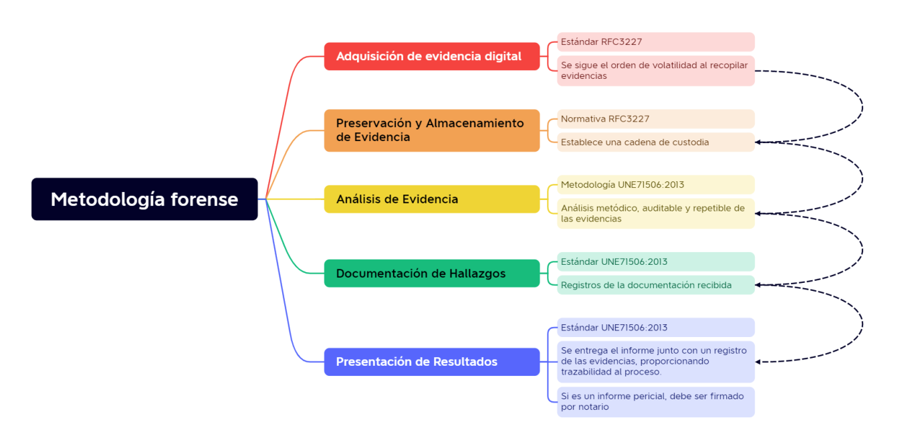

# Proyecto 2: Offensive Audit Services.

---

# Índice:
1. Introducción
2. Metodología
3. Adquisición de evidencias
4. Preservación y almacenamiento
5. Análisis de evidencias
6. Documentación de hallazgos
7. Presentación de resultados
8. Resumen

---

#  Introducción

Habiendo realizado una investigación previa de tres metodologías (RFC3227, UNE 71506:2013 y ISO 27037), hemos creado la nuestra propia a partir de estas.

---

# Metodología

Nuestra metodología va a constar de las siguientes fases:

- Adquisición de evidencias
- Preservación y almacenamiento
- Análisis de evidencias
- Documentación de hallazgos
- Presentación de resultados
- Conclusión

---

# Adquisición de evidencias

Hemos decidido utilizar la que nos ofrede el estándar RFC3227:

- La captura de la adquisición debe de ser lo más precisa posible.

- Detallar las fechas y horas a las que se realizaron la extracción.

- Intentar no sobreescribir las pruebas instalando software, si no es estrictamente necesario.

- Recoger las evidencias en orden de volatilidad:

- Transparencia: nuestro proceso debe ser totalmente reproducible

---

# Preservación y almacenamiento

La única normativa que nos habla de esto con detalle vuelve a ser la norma RFC3227:

* Cadena de custodia. Simplemente documentaremos lo siguiente:

    - Dónde, cuándo y quién descubrió y recolectó la evidencia.
    - Dónde, cuándo y quién manejó la evidencia.
    - Quién ha custodiado la evidencia, cuánto tiempo y cómo la ha almacenado
    - Si se ha cambiado de custodia indicar a quien, que fecha y hora y comprobar que los hashes coinciden
    - Dónde almacenarlo. Dependiendo del dispositivo tendremos que almacenarlo de una u otra forma.

---

# Análisis de evidencias

En esta etapa el estándar que más nos ayuda a que quede claro como actuamos en la fase de análisis es la metodología UNE71506:2013.

1. Comprobar que está dentro de la competencia del laboratorio.
1. Formar un mapa contextual de las evidencias.
1. Revisar la cadena de custodia previa a la llegada de las evidencias al laboratorio.
1. Solicitar las autorizaciones que se precisen para el estudio solicitado, según la legislación vigente.

---
# Análisis de evidencias

5. Comprobar que las evidencias no están deterioradas y que se pueden someter a estudio.
1. Si aparecen nuevas evidencias no contempladas anteriormente, se generará un nuevo proceso de gestión, custodia y trazabilidad, previamente descrita, notificándose al solicitante.
1. Revisar la hora de la BIOS del equipo sometido a estudio, de modo que pueda ser comparada con la fecha del momento en que se active el análisis forense.
1. Establecer unos criterios de prioridades.

---

# Documentación de hallazgos

Al igual que la fase anterior, a la hora de realizar una documentación el estándar UNE71506:2013 es el más completo. Para documentar bien los informes deben de incluir los siguientes apartados:

- Documento de recepción de evidencias informáticas.
- Registro de la documentación recibida donde se puede encontrar una descripción de las evidencias y de la cadena de custodia.
- Registro de las evidencias.
- Registro del tratamiento inicial en el que se describe el proceso de clonado.
- Registro de situación de evidencias, en el que se reflejarán las operaciones practicadas a una evidencia.
- Registro de tareas del análisis.

---

# Presentación de resultados

En esta última etapa, nos guiaremos a través de la norma UNE71506:2013, ya que es la única en la cual se habla de cómo presentar los hallazgos de forma de que sean válidos.

1. Se consolida toda la información derivada del análisis de las evidencias en un informe pericial. 
2. Dicho informe deberá ser firmado por el perito informático y entregado al organismo o entidad que solicitó la evaluación.
3. Tener en cuenta que este informe a menudo se dirige a un público con conocimientos limitados en informática. 
4. Se envía el informe al solicitante, junto con un registro de las evidencias controladas.

---

# Resumen

