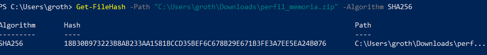

# Informe Técnico Proyecto 5

# Índice
1. [Resumen Ejecutivo](#resumen)   
2. [Introducción](#introduccion)   
    2.1 [Antecedentes](#antecedentes)   
    2.2 [Objetivos](#objetivos)   
    2.3 [Alcance](#alcance)   
3. [Información analizada](#informacion)   
4. [Análisis](#analisis)     
    4.1 [Comparación de hashes](#comparacion)      
    4.2 [Investigación](#investigacion)  
5. [Conclusión](#conclusion)   
   5.1 [Soluciones ante la vulnerabilidad explotada](#soluciones)  
7. [Herramientas usadas](#herramientas)   
8. [Anexo](#anexo) 
    7.1 [Metodología Utilizada](#metodologia) 
7. [Anexo de hallazgos](#anexoh) 

# 1. Resumen Ejecutivo 

Se detectó una vulnerabilidad en una aplicación web tras encontrar el archivo ping.php en la raíz de la aplicación (/root/var/www), utilizado por un intruso para inyectar código en el servidor. Se investigaron los registros de conexión en /root/var/log/apache2/access.log para identificar al atacante, donde se halló su IP, sistema operativo y navegador web. Además, se descubrió una copia del archivo passwd del sistema, llamado passwd.txt, en /root/var/www/, indicando una filtración de información al no estar en la ubicación esperada (/root/etc).

# 2. Introducción 

## 2.1 Antecedentes 

Un técnico, Vicente, recibió la notificación de un posible incidente de seguridad: la infiltración de datos sensibles desde un servidor a través de una aplicación web aparentemente segura. La aplicación web en cuestión, diseñada para realizar escaneos de red remotos, ocultaba una vulnerabilidad crítica. 

## 2.2 Objetivos 

Los objetivos de este informe técnico son:

- Encontrar indicios de la extracción de datos sensibles de la empresa
- Resolver el incidente
- Descubrir información del atacante y su intención

## 2.3 Alcance 

Análisis completo de la imagen del disco del equipo afectado así como de un volcado de su memoria RAM en busca de el rastro dejado por el intruso.

# 3. Información analizada 

| Adquisición | captura_ram.lime |
| --- | --- |
| Tamaño (Bytes) | 1.073.282.112 |
| HASH MD5 | 64381bfe96d147c5c75735b14666dff3 |
| HASH SHA1 | 2abdc4fdacd26e216d10902fef828aaa0e10768b |
| HASH SHA256 | 0f5d751208b08450e298b8d27f22451dd2ae158dfc1cb80b974f360e9a88ff05 |

| Adquisición | image_disco.dd |
| --- | --- |
| Tamaño (Bytes) | 8.589.934.592 |
| HASH MD5 | 6d51519be6b8a7a83a24d20f32de8f1d |
| HASH SHA1 | 9ff3a2604d4c3bc35e2ca245e0952cd4ea80e902 |
| HASH SHA256 | 9f2b2dace6cfebec1b6f956fc231e199c00f39e05d50286b8f284043537d65d9 |

# 4. Análisis 

### 4.1 Comparación de hashes 

Comenzaremos con mostrar los hashes SHA-256, que veía con las pruebas:

| Archivos | SHA-256 |
| --- | --- |
| perfil_memoria.zip | 18b30b973223b8ab233aa1581bccd35bef6c678b29e671b3fe3a7ee5ea24b076 |
| captura_ram.lime.zip | 632d3d95260753029d7c9ade15e0dcab69b8fe7eb08d7001d9f923b22ddf003f |
| captura_ram.live | 0f5d751208b08450e298b8d27f22451dd2ae158dfc1cb80b974f360e9a88ff05 |
| imagen_disco.dd.zip | b0189203fa682fd086ed3c52a3723ac46ab896a2fb8e4daf49ed6228bc7d3b76 |
| imagen_disco.dd | 9f2b2dace6cfebec1b6f956fc231e199c00f39e05d50286b8f284043537d65d9 |

Tras eso, empezamos a comparar cada uno de ellos:

- perfil_memoria.zip

SHA256:

- captura_ram.lime.zip

SHA256:

- captura_ram.live

SHA256:

- imagen_disco.dd.zip

SHA256:

- image_disco.dd

SHA256:

Con esto, podemos ver que con los 5 Hashes, coinciden todos con los dados anteriormente.

### 4.2 Investigación 

Se nos alerta que la aplicación vulnerada es web, por lo cual lo primero que hacemos es irnos a la raíz de la aplicación web /root/var/www en la cual encontramos un archivo, ping.php que parece ser el fichero que aprovecho el intruso para inyectar código en el servidor y conseguir su cometido.

(Véase Anexo de hallazgos. Hallazgo 1)

Sabiendo esto, buscamos los logs de conexión para determinar la identidad de este sujeto.

Dicha información se encuentran en la ruta /root/var/log/apache2/ y en el fichero access.log en el cual podemos encontrar tanto la IP, el sistema operativo y el navegador web que estaba utilizando el atacante.

(Véase Anexo de hallazgos. Hallazgo 2)

Si nos vamos a la ruta /root/var/www/, podemos ver que se encuentra el archivo passwd.txt dentro, podemos ver que es una copia del fichero passwd del sistema. Lo cual nos dice que es el que se ha filtrado, debido a que originalmente, donde debería estar el fichero sería en /root/etc no colgado en la aplicación web.

(Véase Anexo de hallazgos. Hallazgo 3)

# 5. Conclusión 

La presencia del archivo ping.php en la raíz de la aplicación sugiere una posible explotación por parte de un intruso para comprometer el servidor. La identificación del atacante a través de los registros de conexión proporciona información crucial para la investigación. Además, la presencia inadecuada de una copia del archivo passwd del sistema en la aplicación web indica una filtración de información sensible. Estos hallazgos destacan la importancia de implementar medidas de seguridad robustas y de realizar una vigilancia continua para proteger los sistemas contra posibles ataques.

### 5.1 Soluciones ante la vulnerabilidad explotada 

- Configurar Reglas de Firewall → Utilizar un firewall para bloquear accesos a direcciones IP no autorizadas. Podemos configurar reglas de firewall para bloquear solicitudes entrantes hacia ese archivo específico.
- Utilizar medidas de seguridad a nivel de aplicación: Implementar la autenticación y autorización en tu aplicación web para restringir el acceso a ciertas funciones o archivos solo a usuarios autenticados y autorizados. E incluso validar y filtrar todas las entradas de usuario para evitar ataques de inyección.
- Actualizar y parchear regularmente: Mantén actualizado tu software y sistema operativo para protegerse contra vulnerabilidades conocidas que podrían ser explotadas.
- Implementar un WAF (Web Application Firewall): Para poder detectar y bloquear intentos maliciosos mediante inspección de tráfico web y la aplicación de reglas de seguridad.

# 6. Herramientas usadas 

FTK Imager:

| Nombre | FTK Imager |
| --- | --- |
| Versión: | 3.1.2 |
| Página web | https://www.mitec.cz/wrr.html |

Autopsy:

| Nombre | Autopsy |
| --- | --- |
| Versión: | 4.21.0 |
| Página web | https://www.autopsy.com/ |

Volatility:

| Nombre | Volatility |
| --- | --- |
| Versión: | 2.7 |
| Página web | https://volatilityfoundation.org/ |

# 7. Anexo 

### 7.1 Metodología Utilizada 

A continuación, se explica la metodología que ha seguido el perito para adquirir y analizar
las evidencias:

- Adquisición de evidencia digital
1. La captura de la adquisición debe ser lo más precisa posible.
2. Detallar las fechas y horas a la que se realizó la extracción.
3. Intentar no sobrescribir las pruebas instalando software, si no es estrictamente
necesario.
4. Recoger las evidencias en orden de volatilidad:
5. Transparencia: A la hora de realizar la adquisición tendremos que explicar
detalladamente el proceso que hemos seguido para que pueda ser totalmente
reproducible.
- Preservación y almacenamiento de evidencia
A la hora de almacenamiento, se documentará:
- Dónde, cuándo y quién descubrió y recolectó la evidencia.
-  Dónde, cuándo y quién manejó la evidencia.
-  Quién ha custodiado la evidencia, cuánto tiempo y cómo la ha almacenado
-  Si se ha cambiado de custodia indicar a quien, que fecha y hora y comprobar que los
hashes coinciden
-  Dónde almacenarlo. Dependiendo del dispositivo tendremos que almacenarlo de una
u otra forma, por ejemplo, si es un dispositivo portátil tendremos que custodiarlo en
una bolsa de Faraday para que no pueda ser comprometido por las redes móviles.
- Análisis de evidencias

Se llevarán a cabo una serie de procesos y tareas que intentarán dar respuesta a preguntas
relacionadas con una intrusión, como su origen, la lista de sistemas afectados, los métodos
usados, etc. Todos estos procesos y tareas deberán realizarse de forma metódica,
auditable, repetible y defendible.

## 8. Anexo de hallazgos 

Hallazgo 1

| Ruta | /root/var/www/ping.php |
| --- | --- |
| Contenido |   |
| MAC | Modify: 2022-05-20 11:09:37.000000000 -0400 |
| Tamaño | 542 |
| HASH MD5 | d3f424335dac2d8af26ad3f0a99a1a7d  |
| HASH SHA1 | 525132ce24328226594b0f97d0ef2d3f8b7a422e |

Hallazgo 2

| Ruta | /root/var/log/apache2/access.log |
| --- | --- |
| Contenido |  |
| MAC | Modify: 2022-05-20 11:21:03.000000000 -0400 |
| Tamaño | 3494 |
| HASH MD5 | a71e80bd1ad541352d5907628f1bb3ce |
| HASH SHA1 | 640b5541fb9d263389b923ad786701ab149f84f9 |

Hallazgo 3

| Ruta | /root/var/www/passwd.txt |
| --- | --- |
| Contenido |  |
| MAC | Modify: 2022-05-20 11:13:49.000000000 -0400 |
| Tamaño | 1626 |
| HASH MD5 | 7cd7b33f99cc526d01473b553e1042d5 |
| HASH SHA1 | 2d8c72a744c486342f5ec770ac27e8dd7b2f2ee0 |

