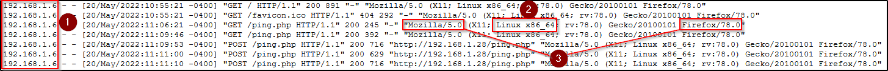

# Preguntas Proyecto 5: Incident on Linux Server I

## 1. Identificar la vulnerabilidad en la aplicación web que fue explotada por el atacante.
Se utilizo el archivo ping.php para realizar ejecución de código remoto en la ruta /root/var/www/ping.php

[PHP-ping - 'Count' Command Execution](https://www.exploit-db.com/exploits/23487)

## 2. Determinar la IP, el cliente y el sistema operativo utilizado por el atacante durante el ataque.
    
     Todos estos datos podemos encontrarlos dentro de los logs creados por el servidor de Apache2.
    
    1. IP del Atacante .
    2. Sistema y cliente del atacante.
    3. Cliente del atacante.
    
    Ruta: /root/var/log/apache2/access.log
    

## 3. Descubrir qué datos fueron exfiltrados del servidor comprometido.
    
    Si nos vamos a la ruta /root/var/www/passwd.txt, podemos ver que se encuentra el archivo passwd.txt dentro y si vemos dentro de el, podemos ver que es una copia del fichero passwd. Esto lo hemos podido comprobar gracias a una cadena ingresada en el ping.php, en el cual podemos ver la inyección de código, pasando el contenido del fichero al dicho .txt.
    
    
    

## 4. Analizar por qué el archivo original no muestra actividad durante el incidente.
Dentro de la carpeta /root/etc, podemos encontrar dos archivos passwd, con una gran diferencia, en uno de los ficheros esta con un guion. Incluso tienen el mismo contenido . Lo que nos hace sospechas, que probablemente copio el fichero de passwd a ese fichero, para luego ponerlo con passwd.txt en /root/var/www/passwd.txt y luego obtener el fichero.
    
    
    
    Como lo que ha realizado el atacante ha sido una copia del fichero /etc/passwd, visto en la respuesta de la pregunta anterior, este no se ha visto modificado, simplemente se ha creado la copia de dicho fichero en la ubicación de la explotación /var/www/apache2/
    
## 5. Proponer soluciones para reparar la vulnerabilidad explotada.
    - Configurar Reglas de Firewall → Utilizar un firewall para bloquear accesos a direcciones IP no autorizadas. Podemos configurar reglas de firewall para bloquear solicitudes entrantes hacia ese archivo específico.
    - Utilizar medidas de seguridad a nivel de aplicación: Implementar la autenticación y autorización en tu aplicación web para restringir el acceso a ciertas funciones o archivos solo a usuarios autenticados y autorizados. E incluso validar y filtrar todas las entradas de usuario para evitar ataques de inyección.
    - Actualizar y parchear regularmente: Mantén actualizado tu software y sistema operativo para protegerse contra vulnerabilidades conocidas que podrían ser explotadas.
    - Implementar un WAF (Web Application Firewall): Para poder detectar y bloquear intentos maliciosos mediante inspección de tráfico web y la aplicación de reglas de seguridad.
