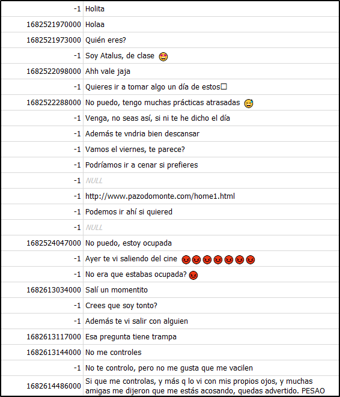
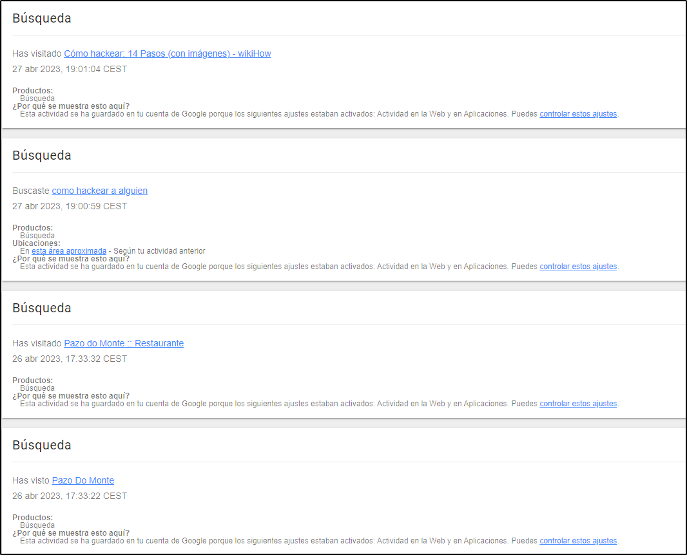
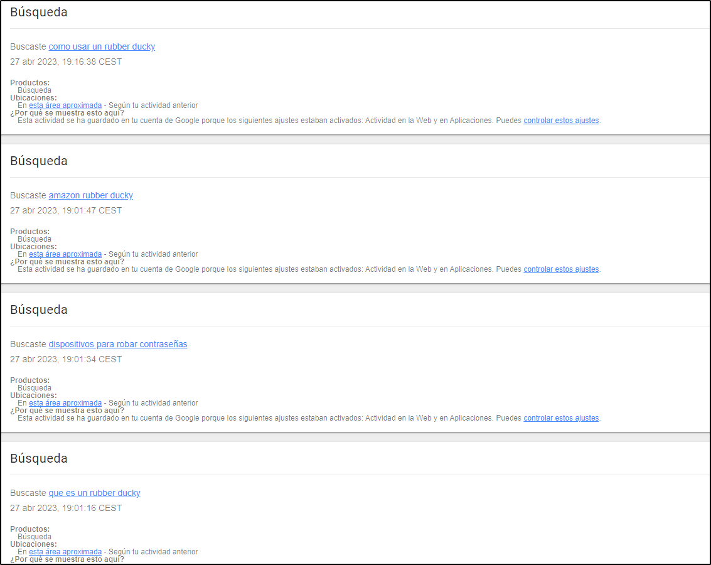

# Anexo

Índice

1. Metodología Utilizada
2. Herramientas
3. Anexo Imágenes
4. Anexo Vestigios

## 1 Metodología Utilizada

A continuación, se explica la metodología que ha seguido el perito para adquirir y analizar
las evidencias:

- Adquisición de evidencia digital
1. La captura de la adquisición debe ser lo más precisa posible.
2. Detallar las fechas y horas a la que se realizó la extracción.
3. Intentar no sobrescribir las pruebas instalando software, si no es estrictamente
necesario.
4. Recoger las evidencias en orden de volatilidad:
5. Transparencia: A la hora de realizar la adquisición tendremos que explicar
detalladamente el proceso que hemos seguido para que pueda ser totalmente
reproducible.
- Preservación y almacenamiento de evidencia
A la hora de almacenamiento, se documentará:
- Dónde, cuándo y quién descubrió y recolectó la evidencia.
-  Dónde, cuándo y quién manejó la evidencia.
-  Quién ha custodiado la evidencia, cuánto tiempo y cómo la ha almacenado
-  Si se ha cambiado de custodia indicar a quien, que fecha y hora y comprobar que los
hashes coinciden
-  Dónde almacenarlo. Dependiendo del dispositivo tendremos que almacenarlo de una
u otra forma, por ejemplo, si es un dispositivo portátil tendremos que custodiarlo en
una bolsa de Faraday para que no pueda ser comprometido por las redes móviles.
- Análisis de evidencias

Se llevarán a cabo una serie de procesos y tareas que intentarán dar respuesta a preguntas
relacionadas con una intrusión, como su origen, la lista de sistemas afectados, los métodos
usados, etc. Todos estos procesos y tareas deberán realizarse de forma metódica,
auditable, repetible y defendible.

## 2 Herramientas

DB Browser for SQLite

| Nombre | DB Browser for SQLite |
| --- | --- |
| Versión: | 3.12.2.0 |
| Página web | https://www.mitec.cz/sqliteq.html |

FTK imager

| Nombre | FTK Imager |
| --- | --- |
| Versión: | 3.1.2 |
| Página web | https://www.mitec.cz/wrr.html |

Android Backup Extractor

| Nombre | Android Backup Extractor |
| --- | --- |
| Versión: | master-20221109063121-8fdfc5e: Merge pull request #101 from nelenkov/renovate/gradle-7.x |
| Página web | https://github.com/nelenkov/android-backup-extractor |

SysTools MBOX Viewer

| Nombre | SysTools MBOX Viewer |
| --- | --- |
| Versión: | 4.0.0.0 |
| Página web | https://www.systoolsgroup.com/mbox-viewer.html |
- USB Detective V1.2

| Nombre | USB Detective |
| --- | --- |
| Versión: | 1.2 |
| Página web | https://usbdetective.com/ |

## 3 Anexo de Imágenes

Índice de imágenes

Imagen 1

Imagen 2

Imagen 3

Imagen 4

Imagen 5

Imagen 6

Imagen 7

Imagen 8

Imagen 9

Imagen 10

Imagen 11

Imagen 12

Imagen 13

Imagen 14

Imagen 15

Imagen 16

Imagen 17

Imagen 18

Imagen 19

Imagen 20

Imagen 21

Imagen 22

Imagen 23

Imagen 1

Imagen 2

Imagen 3

Imagen 4

Imagen 5

Imagen 6

Imagen 7

Imagen 8

Imagen 9

Imagen 10

Imagen 11

Imagen 12

Imagen 13

Imagen 14

Imagen 15

Imagen 16

Imagen 17

Imagen 18 

Imagen 19

Imagen 20

Imagen 21

Imagen 22

Imagen 23

## 4 Anexo de Vestigios

Vestigio 1

| Ruta | WhatsApp-Database-Lassandra-Cordalis/WhatsApp-Database-Lassandra-Cordalis/msgstore.db |
| --- | --- |
| MAC |  |
| Tamaño |  |
| HASH MD5 | 4f7e0758d093ce4cf33e1c851dc62c9f |
| HASH SHA256 | dcc837420c7d72b7b3ea09483ff0586daa7a50ca9c8c78b790db95866dcae0f5 |
| Contenido |  |

Vestigio 2

| Ruta | /WhatsApp_Database_Atalus_Grasstem/msgstore.db |
| --- | --- |
| MAC |  |
| Tamaño | 1273856 |
| HASH MD5 | abfacf6b7a029fe358d0a13c3ce7e2a8 |
| HASH SHA256 | 4a053239cfacab3f674a875c84cc0d80d873a418e608e1be249a26f93870f3cc |
| Contenido |  |

Vestigio 3

| Ruta | Google-Data-Atalus-Grasstem/Takeout/Mi actividad/Búsqueda/MiActividad.html |
| --- | --- |
| MAC |  |
| Tamaño | 168832 |
| HASH MD5 | 107aa75dd60145151336cccaab37f21e |
| HASH SHA256 | dcbd51ba2f77917998623ae88b82ff10697bd8b53c78a46bbc9d6a8e28bcf1fe |
| Contenido |  |

Vestigio 4

| Ruta | Telegram-Data-Lassandra-Cordalis/telegram/apps/org.telegram.messenger/f/cache4.db |
| --- | --- |
| MAC |  |
| Tamaño | 1388544 |
| HASH MD5 | 48fd1091cab6792ec9f4f79184fc4a8e |
| HASH SHA256 | 7c0cbac0764d013f7a25b5fddabdc2e74706cd17c04d7c30c4d51c58b254b5eb |
| Contenido |  |

Vestigio 5

| Ruta | H:\2023-04-28\001\dav\17\17.39.20-17.39.44[M][0@0][0].dav |
| --- | --- |
| MAC |  |
| Tamaño | 2996 |
| HASH MD5 | D3FA864032CD8FFD1CEF129A36CF12F2 |
| HASH SHA256 | 021D1FCECC68A891511F68C289DA96A1685BFD07191653B7950DA74B9403CC30 |
| Contenido | Video en el que se muestra a alguien encapuchado manejando un ordenador, y luego inserta un dispositivo dentro del ordenador de la víctima. |

Vestigio 6

| Ruta | H:\2023-04-28\001\dav\17\17.59.49-18.01.13[M][0@0][0].dav |
| --- | --- |
| MAC |  |
| Tamaño | 3254 |
| HASH MD5 | 12ECF537472C82E6BF0E468943DDB3AF |
| HASH SHA256 | C1AC93D989B1001AE5B86BEA7CDAD34144A52A39E91B381D2CCC4518578209C7 |
| Contenido | Video en el que se muestra a la víctima encender y meter sus credenciales en el ordenador en el que se insertó el dispositivo. |

Vestigio 7

| Ruta | Instagram-lassandracordalis-20230504/login_and_account_creation/login_activity.html |
| --- | --- |
| MAC |  |
| Tamaño | 17298 |
| HASH MD5 | edcaf70f90176acab4af7821e53792cc |
| HASH SHA256 | 2b31a8db5035b22315eefa09182188d15d575c31164642eca09400c340dd1cdb |
| Contenido |  |

Vestigio 8

| Ruta | Google-Data-Atalus-Grasstem/Takeout/Cuenta de Google/atalusgrasstem.SubscriberInfo.html |
| --- | --- |
| MAC |  |
| Tamaño | 2986 |
| HASH MD5 | 71548337338d0d7c2aecb330cc04be68 |
| HASH SHA256 | 49069e702aebb747b41c2e9ecb50064c85e237b2cda207f5974b718599fe57a8 |
| Contenido |  |

Vestigio 9

| Ruta | adb-backup-Atalus-Grasstem.ab\apps\com.android.browser\db\browser2.db |
| --- | --- |
| MAC |  |
| Tamaño | 1093632 |
| HASH MD5 | d454901677e278c43884799496ba7a9f |
| HASH SHA256 | a2be3a1c3bf4f32bcea3cff31dde9de2363a5fca2792835543b15c9654d4d1b8 |
| Contenido |  |

Vestigio 10

| Ruta | Google-Data-Lassandra-Cordalis/Takeout/Correo/Todo el correo, incluido Spam y Papelera.mbox |
| --- | --- |
| MAC |  |
| Tamaño | 178038 |
| HASH MD5 | 6e723fa81c3a0377d9f01ab4e4f9181a |
| HASH SHA256 | 783807d627db0248bb0aff40544bc5078fcd8d882dd88d223819e10456f6b3af |
| Contenido |  |
