# Informe Móvil

## Índice

1. [Resumen Ejecutivo](#resumen)   
    1.1 [Línea Temporal](#linea)  
2. [Introducción](#introduccion)   
    2.1 [Antecedentes](#antecedentes)  
    2.2 [Objetivos](#objetivos)   
    2.3 [Alcance](#alcance)  
3. [Información Analizada](#informacion)  
4. [Análisis](#analisis)    
    4.1 [Comprobación de Hashes](#comprobacion)   
    4.2 [Investigación](#investigacion)  
5. [Conclusión](#conclusion)  
6. [Recomendaciones](#recomendaciones)  

# 1. Resumen Ejecutivo

La investigación revela un caso de acoso cibernético y robo de identidad, donde el presunto sospechoso Atalus intenta obtener contraseñas de la víctima Lassandra a través de un dispositivo Rubber Ducky, con la posible complicidad de Camillo. Se encontraron pruebas de manipulación de perfiles en redes sociales y acceso no autorizado a dispositivos informáticos, junto con amenazas hacia la víctima. La evidencia incluye conversaciones en WhatsApp y Telegram, búsquedas en internet relacionadas y registros de actividad en cuentas sociales, destacando un patrón de comportamiento delictivo en línea.

## 1.1 Línea Temporal

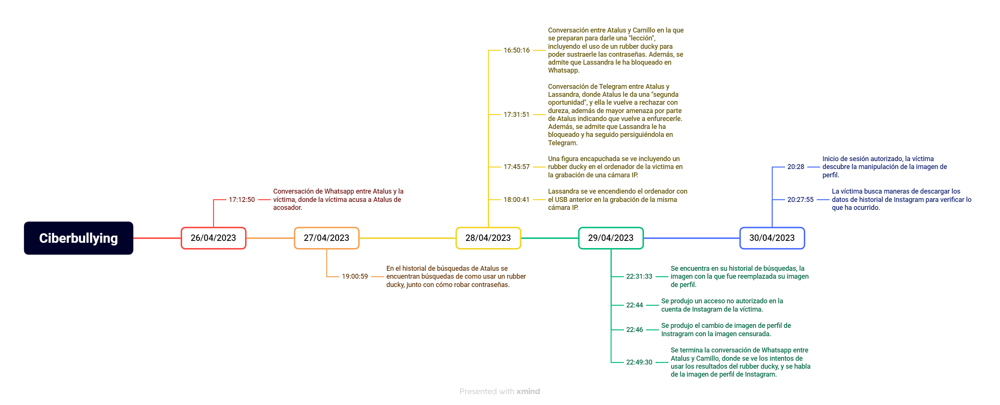

# 2. Introducción

## 2.1 Antecedentes

La estudiante Lassandra Cordalis se ha enfrentado a un problema serio de acoso digital. Se ha reportado comportamiento inapropiado en aplicaciones de chat, y su cuenta de Instagram ha sido comprometida. Lassandra sospecha de dos de sus compañeros, Atalus Grasstem y Camillo Richbald, como posibles responsables.

La situación se agrava aún más cuando Lassandra descubre que su cuenta de Instagram ha sido alterada, posiblemente como resultado del acoso digital que ha estado experimentando.

## 2.2 Objetivos

Los objetivos de este informe técnico son:

- Establecer una línea temporal del incidente de acoso digital
- Obtener evidencia de que el sospechoso ha estado acosando a la estudiante en aplicaciones de chat
- Identificar si el sospechoso está involucrado en el defacament de la cuenta de Instagram de la estudiante

## 2.3 Alcance

Análisis completo de los dispositivos móviles, WhatsApp y servidor Google de los involucrados. Análisis de el Telegram, Instagram y ordenador en el instituto de la víctima. Y analizar la la cámara IP Imou.

# 3. Información analizada

| Adquisición | Tamaño (Bytes) | HASH SHA-256 | HASH MD5 | HASH SHA1 |
| --- | --- | --- | --- | --- |
| adb-backup-Atalus-Grasstem.ab | 29.013.457 | e64e952c3f43c235baf5d83f8cea1a86d7640821baefcbe89c480b0fff7688cf | 69E1E89FD971E5817A2C8C6279A80601 | 7EA6F0F6CADE8F6FA55C01C51C683216CD53D463 |
| adb-backup-Camillo-Richbald.ab | 158.652 | 9c9c983de848c7b600a8f97a191b2fc7f9c77f5826de42fef93b410094bfac43 | 927713F263F80B4B747F65E58A1BDD53 | 985B4C25B4B72201A7ED591338FBDA9629E12154 |
| adb-backup-Lassandra-Cordalis.ab | 523.014 | 40e6f12cf248468c2849aa2c8094d186b0264bb758d4839ee190486721da013a | DDFF7DFE751359D2C7ED4E743B91A774 | FC560A40196DC92D463C172481FBAF166D223C76 |
| Disco-pc-infectado-ducky.img.zip | 5.773.164.742 | a61abd7be758d6f494e84fcb743e78e65d3b30f95ffab7e65839fceaf3f7b21d | F5C17537B21F0E048237B9B6B1865548 | 3A7847F7BF9FE91D2794ED3B12CAC9953FADD63C |
| disco-pc-infectado-ducky.img | 53.687.091.200  | 33a147e409a2400a762845932c9cde7ce280fc944f4a6e6e50d8e0aece2f2ef0 | 39A7E7302BEB29233E579B5AC5DC8D4E | 1BFB7525B55F84CF9ABF776DE273533DF84D2204 |
| Google-Data-Atalus-Grasstem.zip | 561.760 | e808a0bd5b9b55eb1ba536aa704c0e80164375e0fa96623f997ce5696a370a8a | B5842A7BA3C0C5FE58CDE803987C22AF17E49C65 | 0013A261768BB2E03410A4EE6AFCDF1D |
| Google-Data-Camillo-Richbald.zip | 408.222 | 47854017fc1f147d8426184519b1b21357f7876a9513ab40d093baf215ee6b3c | 7B06EAE50B2601998BDB3EFB0969854A | B0BD8808EB5A00DFD77F98E8E4EC259719A02B45 |
| Google-Data-Lassandra-Cordalis.zip | 588.782 | 0a1989aeae247aaba70621795127d0b8de6be5d84e1a592269d457432c3c4ffa | 97AC95C08C9A2D5F3CD6780DEA9D27DC | ED5F5E2B68BC3021047AC7B6A1FD4B92B23F81D4 |
| imagen-sd.ad1 | 6.847.296 | 1beec3df0227eb8d26fc5810411a350fb62761b469fc380074d8978a7a048469 | 6DD44CD661AFED3D93EB96BDE12211BD | 22343FCE02A07CFE840104DA093715259F6738D1 |
| Instagram-lassandracordalis-20230504.zip | 735.897 | 07d015c094f37433e5f33634154544fc8d020c98cec038d32cab09e9d7e048f2 | 79B280F3FDA049A6B01DAF29BE56CDD4 | 515A23EB81ECC3E176DC2FEEB2DB5A0265ABFC2C |
| Telegram-Data-Lassandra-Cordalis.zip | 30.820.559 | 0e02fce437a698421c947b87c642704109d3d839d1a64ac1b365de1662cd3056 | 3ADBD1827E451EFA13F0DBB2227E7BC2 | 19B07D30A39565EE6AF03A90AA5FF5B64239797D |
| WhatsApp-Database-Atalus-Grasstem.zip | 131.501 | a50e56d3e6789b346cce39a90f392b88327000b3524c9cde231c7819a9c8da1f | 4591F56EE8ECCD774F896D43474104CD | D2A083436193A161E53F1D1E031CE0500ACBC69F |
| WhatsApp-Database-Camillo-Richbald.zip | 185.621 | c701ae767b8800ab15b201522611c23c23a5655d6d98b348e3b045076f5b8cef | 3478B015C867DFBCEECFCC49BC09C76E | B9BABDD79B25642826ECF3854842EBCDF915F222 |
| WhatsApp-Database-Lassandra-Cordalis.zip | 167.088 | 83b83a02e748e322933bbe29d98bdf8c21af8fd5457185a9d5ee903f9079e3c5 | 1477180EFC30A310B09166274D509C77 | 934014579462B514AA5D4A897558B17A6E63DFD0 |

# 4. Análisis 

### 4.1 Comparación de hashes

Comenzaremos con realizar la comparación de hashes con los que nos han sido otorgados:

- **adb-backup-Atalus-Grasstem.ab**

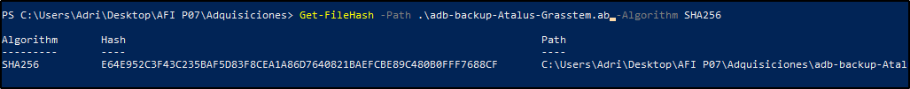

- **adb-backup-Camillo-Richbald.ab**

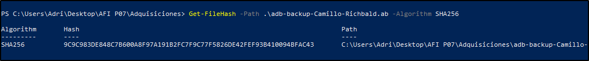

- **adb-backup-Lassandra-Cordalis.ab**

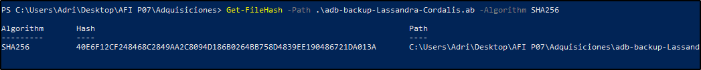

- **Disco-pc-infectado-ducky.img.zip**

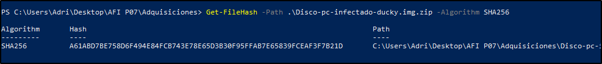

- **disco-pc-infectado-ducky.img**

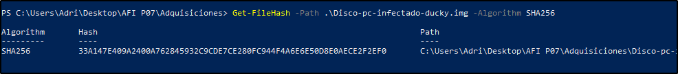

- **Google-Data-Atalus-Grasstem.zip**

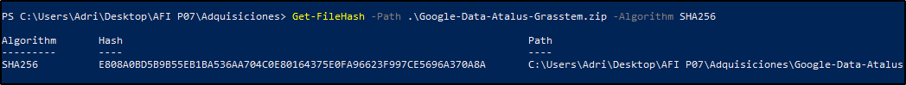

- **Google-Data-Camillo-Richbald.zip**

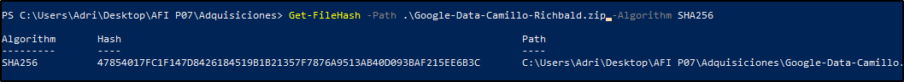

- **Google-Data-Lassandra-Cordalis.zip**

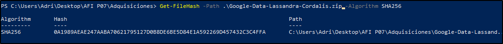

- **imagen-sd.ad1**

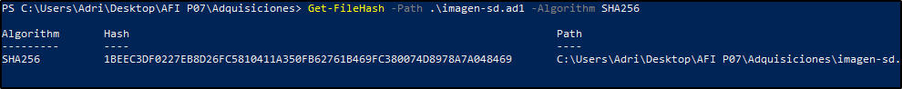

- **Instagram-lassandracordalis-20230504.zip**

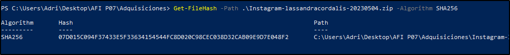

- **Telegram-Data-Lassandra-Cordalis.zip**

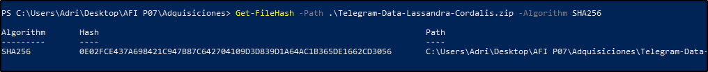

- **WhatsApp-Database-Atalus-Grasstem.zip**

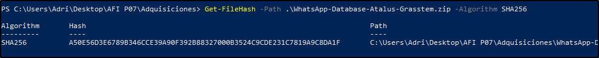

- **WhatsApp-Database-Camillo-Richbald.zip**

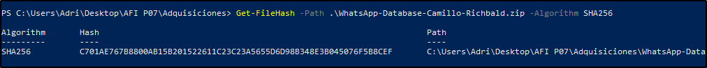

- **WhatsApp-Database-Lassandra-Cordalis.zip**

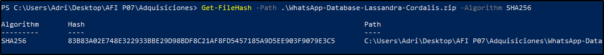

Con esto, podemos ver, que todos los Hashes coinciden con los que nos han proporcionado.

### 4.2 Investigación

Comenzamos la investigación con las conversaciones de WhatsApp de la víctima con el presunto sospechoso Atalus, en la cual se puede observar como Atalus intenta invitar a salir a la víctima a cenar, el cuál es rechazado por esta.

# [Véase Anexo de Imágenes. Imagen 1.](#https://github.com/IES-Rafael-Alberti/23-24-G1-Ciberseguridad/blob/main/Analisis%20Forense/Proyecto%207%20Cyberbullying/Anexos.md#1)

Véase Anexo de Imágenes. Imagen 2.

Véase Anexo de Vestigios. Vestigio 1. 

En la conversación de WhatsApp de Atalus podemos encontrar esta misma conversación y otra más con el presunto cómplice Camillo, en esta conversación, encontramos la frustración de Atalus ante el rechazo de Lassandra y su bloqueo de esta red social, haciendo indicios de que utilizará un Rubber Ducky para robarle las contraseñas a la víctima y Camilo incita a Atalus que lo haga. 

Véase Anexo de Imágenes. Imagen 3.

Véase Anexo de Imágenes. Imagen 4.

Véase Anexo de Vestigios. Vestigio 2.

Realizando un análisis del dispositivo móvil de Atalus, hemos encontrado en el historial de búsquedas del navegador una serie de búsquedas de información sobre como funciona este tipo de dispositivo, así como búsquedas de información sobre como robar contraseñas o hackear a alguien.

Véase Anexo de Imágenes. Imagen 5.

Véase Anexo de Imágenes. Imagen 6.

Véase Anexo de Vestigios. Vestigio 3. 

Ante el bloqueo de Lassandra a Atalus, este pasa a iniciar una conversación a través de Telegram, en el cuál observamos que este está enfadado por el bloqueo y empieza una serie de amenazas contra Lassandra al no “aceptar su segundo oportunidad”.

Véase Anexo de Imágenes. Imagen 7.

Véase Anexo de Imágenes. Imagen 8.

Véase Anexo de Imágenes. Imagen 9.

Véase Anexo de Imágenes. Imagen 10.

Véase Anexo de Imágenes. Imagen 11.

Véase Anexo de Vestigios. Vestigio 4.

En las grabaciones de una cámara IP del centro, se puede observar a un señor encapuchado introducir un dispositivo en un ordenador y luego marcharse.

Véase Anexo de Imágenes. Imagen 12.

Véase Anexo de Vestigios. Vestigio 5.

Al cabo del tiempo, se puede ver a la víctima trabajar en el mismo pc manipulado anteriormente.

Véase Anexo de Imágenes. Imagen 13.

Véase Anexo de Vestigios. Vestigio 6.

Observamos que en los inicios de sesión en la cuenta de Instagram de Lassandra, han habido tres inicios de sesión desde dispositivos distintos, el primer inicio de sesión podemos ver que ha sido desde un agente de navegador de un equipo de sobremesa, y la hora concuerda con la visualizada en el video número 2 (foto número 14). El segundo inicio de sesión se realiza desde el dispositivo móvil de Atalus, ya que podemos ver que el agente de inicios de sesión coincide con su agente de usuario (foto número 15). Para todos los datos relacionados con Instagram, hemos tomado como referencia la hora dada por los inicio de sesión, dado que en nuestro horario ería +2, debemos sumarle dos hora a las horas dadas en estos y 10 a las dadas por Instagram.

Véase Anexo de Imágenes. Imagen 14.

Véase Anexo de Imágenes. Imagen 15.

Véase Anexo de Imágenes. Imagen 16.

Véase Anexo de Imágenes. Imagen 17.

Véase Anexo de Vestigios. Vestigio 7.

Véase Anexo de Vestigios. Vestigio 8.

Se puede ver en el historial de su navegador móvil, que el presunto sospechoso ha iniciado sesión en Instagram y edita el perfil de la víctima. 

Véase Anexo de Imágenes. Imagen 18.

Véase Anexo de Vestigios. Vestigio 9.

En la conversación de WhatssApp entre Camillo y Atalus vista anteriormente, Camilo incita a Atalus a colocar una foto de perfil en el Instagram de Lassandra, podemos ver en las registros de búsqueda de Google de Atalus una imagen idéntica con la que se encontró la víctima como foto de perfil. 

Véase Anexo de Imágenes. Imagen 19.

Véase Anexo de Imágenes. Imagen 20.

Véase Anexo de Imágenes. Imagen 21.

En el correo de la víctima podemos observar los diferentes inicios de sesión de Instagram.

1- Inicio de sesión en el navegador web en el equipo del centro.

2- Inicio de sesión desde un nuevo dispositivo móvil presuntamente el de Atalus.

3- Inicio de sesión en el cual descubre la alteración.

Véase Anexo de Imágenes. Imagen 22.

Véase Anexo de Vestigios. Vestigio 10.

Lassandra entra a su cuenta de Instagram y observa los cambios hechos en su cuenta y busca una forma de descargarse el informe de la cuenta para ver si ha sido comprometida.

Véase Anexo de Imágenes. Imagen 23.

# 5. Conclusión

Tras analizar todo, podemos ver claro que hay indicios de “cyberbullying” y se debe a un rechazo que hizo Lassandra a Atalus por WhatssApp. Atalus le dio una “segunda oportunidad” a Lassandra, el cual se lo hizo saber por Telegram, pero ella de nuevo lo rechazó. Entonces, Atalus como “venganza”, juntó a la coacción de Camilo, robó las credenciales de Lassandra, gracias a un USB de Rubber Ducky que conectó en el ordenador del colegió de la víctima y entró a la cuenta de instagram de la víctima y le cambió la foto de perfil.

Hay que añadir, que en la conversación entre Camilo y Atalus, se habla de otro caso de cyberbullying que provocó el usuario Atalus, que llegó a la víctima a irse del colegio.

# 6. Recomendaciones

Tras ver que este caso, y lo que ha generado en las cuentas de usuario, recomendamos:

- Revisión de políticas de seguridad: Evaluar y actualizar las políticas de seguridad de la escuela.
- Educación en seguridad digital: Proporcionar capacitación en seguridad digital tanto para alumnos como para personal educativo. Hay que enseñar la importancia de proteger las contraseñas, identificar los intentos de phishing y la necesidad de respetar la privacidad entre otros usuarios.
- Refuerzo de la autenticación: Implementar medidas de autenticación más sólidas, como el uso de contraseñas seguras y recomendar a los alumnos que usen la autenticación de dos factores para las cuentas de usuario. Esto añade una capa adicional de seguridad al requerir un segundo método de verificación.
- Sensibilización sobre la privacidad: Educar a los alumnos sobre la importancia de respetar la privacidad de otros alumnos y la gravedad de acceder a cuentas ajenas sin permiso.
