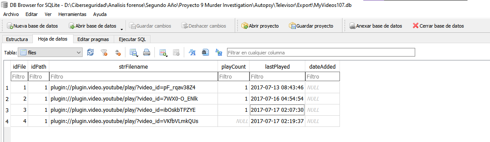

# Informe Pericial Proyecto 9

# Índice

1. Juramento de Decir la verdad 
2. Glosario de palabras clave
3. Índice de figuras
4. Resumen ejecutivo
5. Introducción
5.1 Antecedentes
5.2 Objetivos
5.3 Fuentes de información
5.4 Adquisición de evidencias
6. Análisis
6.1 Herramientas usadas
6.2 Investigación
 6.2.1 Análisis de Raspberry Pi TV
 6.2.2 Análisis de Alexa
7. Limitaciones
8. Conclusiones
9. Anexo I. Sobre el perito
10. Anexo II. Fuentes de información
10.1 Smartphone de la victima
10.2 Smartphone del marido
10.3 Datos de Amazon Echo Alexa
10.4 Raspberry Pi (TV inteligente)
10.5 Tráfico de red del SmartHome
10.6 Informe de diagnóstico de Google OnHub
11. Anexo III Hallazgos
12. Referencias

# Juramento de Decir la verdad

Los peritos firmantes de este documento juramos solemnemente decir la verdad, toda la verdad y nada más que la verdad en este informe judicial. Prometemos que nuestras conclusiones y opiniones se basarán en los hechos, la evidencia y en nuestra experiencia profesional. Comprendemos la importancia de nuestro testimonio y la responsabilidad que conlleva en contribuir a la búsqueda de la justicia y la verdad en este asunto. Por lo tanto, nos comprometemos a cumplir con la ética y los estándares de nuestra profesión en todo momento.

# Glosario de palabras clave

- Caché: Es un componente de hardware o software que guarda datos para que las solicitudes futuras de esos datos se puedan atender con mayor rapidez.
- Alexa: Es un asistente virtual desarrollado por Amazon.
- Base de Datos: Es un conjunto de datos estructurados que pertenecen a un mismo contexto  y, en cuando a su función, se utiliza para administrar de forma electrónica grandes cantidades de información.

# Índice de figuras

1. Tabla: Comprobación hashes
2. Tabla: Herramientas usadas
3. Imagen: Captura videos emitidos TV Inteligente
4. Tabla: Videos y hora emitidos en TV Inteligente
5. Imagen: Dispositivo Alexa conectado a TV Inteligente
6. Imagen: Modelo de Alexa conectado a TV Inteligente
7. Imagen: Dispositivo Pulsera Xiaomi conectado a TV Inteligente
8. Imagen: Modelo Pulsera inteligente conectada a TV Inteligente
9. Imagen: Auriculares Bluetooth móvil del marido
10. Imagen: Modelo Auriculares Bluetooth móvil del marido
11. Imagen: History second page de Alexa
12. Imagen: History first page de Alexa
13. Tabla: DNI de los peritos
14. Tablas: Hashes contenido del móvil de la víctima
15. Tablas: Hashes contenido del móvil del marido de la víctima
16. Tabla: Hashes Alexa
17. Tabla: Hashes Raspberry Pi
18. Tabla: Hashes Tráfico de red de Smarthome
19. Tabla: Hashes Informe de Google OnHub
20. Tabla: Hallazgo 1
21. Tabla: Hallazgo 2

# Resumen ejecutivo

En respuesta a la presunta cuartada proporcionada por el esposo de la víctima, quien afirmó estar viendo una película en su habitación en el momento del crimen, se inició una investigación centrada en la televisión de la habitación. 

El análisis de estos videos reveló que uno de ellos no había sido reproducido completamente, sugiriendo que la película no había sido vista en su totalidad. Además, el esposo afirmó haber estado escuchando la película a través de auriculares mientras su esposa reproducía música.

Al examinar los archivos de caché de los dispositivos conectados por Bluetooth a la televisión, se identificaron dos dispositivos: uno correspondiente a Alexa y otro a una pulsera inteligente Xiaomi MI1A. Investigaciones adicionales revelaron que la televisión fue encendida a las 15:01 del día del crimen, contradiciendo el testimonio del esposo, quien afirmó haber estado viendo la película desde antes de la hora del crimen hasta el momento en que fue visto saliendo de la casa.

Los registros de audio de Alexa capturaron voces femeninas y masculinas durante el período en que el esposo afirmó estar viendo la película. Este descubrimiento sugiere discrepancias significativas en la coartada proporcionada por el esposo de la víctima.

# Introducción

## Antecedentes

El caso involucra el asesinato de una mujer en su residencia, reportado por su esposo y el conserje del edificio. A las 15:31 del 17 de julio de 2017, el conserje llamó al número de emergencia 112 para informar sobre el incidente. La policía llegó a la escena a las 15:40, encontrando a la víctima sin vida en el salón, aparentemente fallecida por múltiples puñaladas. El esposo declaró haber llegado a casa alrededor de las 15:00 y descubierto el cuerpo después de ver una película en el dormitorio, durante la cual llevaba auriculares. Colaboró con la investigación, pero no pudo proporcionar las contraseñas de los dispositivos electrónicos de la víctima.

## Objetivos

Los objetivos de este informe pericial son:

- Demostrar la veracidad de la cuartada del marido.
- Realizar un timeline con el fin de aclarar los hechos.
- Investigar los datos de los dispositivos proporcionados.

## Fuentes de información

Véase en el Anexo II. Fuentes de Información.

### Adquisición de evidencias

Realizamos una comprobación de veracidad sobre las fuentes de evidencias proporcionadas por las autoridades.

| Archivo | HASH MD5 Proporcionado  | HASH MD5 | HASH SHA-256 Proporcionado | HASH SHA-256 |
| --- | --- | --- | --- | --- |
| InformeDiagnosticoOnHub | 4a07bd78d8f4ba227841c971eeb7d1b3 | 4a07bd78d8f4ba227841c971eeb7d1b3 | 4767513d714698afcd7506dd2304528a8db8243e2dff1be6e1ede591d0d19f83 | 4767513d714698afcd7506dd2304528a8db8243e2dff1be6e1ede591d0d19f83 |
| Tráfico_SmartHome_PorCOAP.pcap | 67ab09760148a66402aa7d9b0abaa322 | 67ab09760148a66402aa7d9b0abaa322 | f5ad42a50ca0d16261c1ca4742d78fd99c9e7fc6ab67fdb3a53909ff7f786ce0 | f5ad42a50ca0d16261c1ca4742d78fd99c9e7fc6ab67fdb3a53909ff7f786ce0 |
| Trafico_SmartHome_PorIP.pcap | 8fb0edb521c9ad191adf55054203a6f4 | 8fb0edb521c9ad191adf55054203a6f4 | a4664f1719d26382edd6d352cc8715fea3ee73bbb00245d71943fbacbbeeca3e | a4664f1719d26382edd6d352cc8715fea3ee73bbb00245d71943fbacbbeeca3e |
| Alexa.zip | 93639c62f68c5155611bbd7e8eb3f477 | 93639c62f68c5155611bbd7e8eb3f477 | 6c09813eea5475dc0011c547e7fb774cfbd7216cafdeeb9a8308306046c14edf | 6c09813eea5475dc0011c547e7fb774cfbd7216cafdeeb9a8308306046c14edf |
| movil_chica.zip | 8daf9d23e39675452f99c5099a72b317 | 8daf9d23e39675452f99c5099a72b317 | c3e334c996b811c51067e9e0657cb621523576f15eb2c19ec52c32bf36e3e5ff | c3e334c996b811c51067e9e0657cb621523576f15eb2c19ec52c32bf36e3e5ff |
| movil_chico.zip | 1472be511173e7e0f4919958b1c96ffe | 1472be511173e7e0f4919958b1c96ffe | 5a46acdf7fb5a70734a2e0e39a8c9b5cc9b7ee799fe800a0a7512af08e15c025 | 5a46acdf7fb5a70734a2e0e39a8c9b5cc9b7ee799fe800a0a7512af08e15c025 |
| TV_Inteligente.zip | d9d2b3b3048a836289cec02c6353b6e9 | d9d2b3b3048a836289cec02c6353b6e9 | 5423ea3f60d4ad0874346d3ba31c8783e5f2ce4b15b261ba0085e07f11e650e6 | 5423ea3f60d4ad0874346d3ba31c8783e5f2ce4b15b261ba0085e07f11e650e6 |

*Tabla: comprobación hashes* 

Tras el análisis de todos los hashes de todos los ficheros, podemos decir, que coinciden con los hashes proporcionados.

### Análisis de Raspberry Pi TV

Como el marido de la victima aseguraba estar viendo una película en la televisión de su habitación en los momentos de los hechos, decidimos comenzar la investigación con esta y comprobar que es cierto.

Haciendo una investigación sobre los ficheros de la adquisición de la televisión inteligente, encontramos que esta tiene un plugin de Youtube instalado, este nos genera una base de datos, en la cual podemos observar los vídeos que han sido vistos desde ella. Observando los videos, hemos podido encontrar los vistos el día del suceso.

Esta base de datos se encuentra en la ruta:

 `“\E001SmartTVMMC\home\osmc\.kodi\userdata\Database\MyVideos107.db”`

*Imagen: Captura videos emitidos TV Inteligente*

Podemos comprobar la zona horaria de la televisión en su información del sistema, una vez comprobada esta podemos afirmar que la ubicación es “América/New York“. Esta información podemos encontrarla en la ruta:

`“/etc/timezone”`

Una vez que conocemos la zona horaria en la que se encuentra la televisión, debemos realizar la conversión de estas horas, como aún no se encuentran en horario de verano, tendremos que sumar trece horas a las horas dadas, quedando como las mostradas en la siguiente tabla:

| plugin://plugin.video.youtube/play/?video_id=pF_rqav38Z4 | 2017-07-13 21:43:46 |
| --- | --- |
| plugin://plugin.video.youtube/play/?video_id=7WX0-O_ENlk | 2017-07-16 17:54:54 |
| plugin://plugin.video.youtube/play/?video_id=ibOskbTPZYE | 2017-07-17 15:07:30 |
| plugin://plugin.video.youtube/play/?video_id=VKfbVLmkQUs | 2017-07-17 15:19:37 |

*Tabla: Videos y hora emitidos en TV Inteligente*

Podemos comprobar que el video terminado en “VKfbVLmkQUs” no dispone playCount, lo cual nos indica que el video no se llegó a terminar de reproducir. 

El marido de la victima, aseguraba también estar haciendo uso de unos auriculares bluetooth para ver una película, ya que su esposa estaba escuchando música en la otra habitación.

Continuando la investigación de este dispositivo, encontramos en la cache los distintos dispositivos bluetooth que están vinculados a este, podemos observar que no se encuentra ningún dispositivo de auriculares bluetooth, esto podemos hallarlo en la siguiente ruta:

`“/var/lib/bluetooth/B8:27:EB:E6:8D:79/cache/74:C2:46:88:5D:09”`

*Imagen: Dispositivo Alexa conectado a TV Inteligente*

Este primero, si buscamos el nombre del dispositivo en Google encontramos que corresponde al dispositivo Alexa.

*Imagen: Modelo de Alexa conectado a TV Inteligente*

El otro dispositivo conectado en la televisión sería:

`“/var/lib/bluetooth/B8:27:EB:E6:8D:79/cache/88:0F:10:F6:C8:B7"`

*Imagen: Dispositivo Pulsera Xiaomi conectado a TV Inteligente*

Este correspondería al siguiente dispositivo Mi1A Band.

*Imagen: Modelo Pulsera inteligente conectada a TV Inteligente*

Analizando la información del dispositivo móvil del marido, se han encontrado los dispositivos bluetooth que han sido conectados a este. Hemos podido confirmar que estos no se han encontrado conectados a la televisión inteligente.

*Imagen: Auriculares Bluetooth móvil del marido*

El nombre de este dispositivo, si lo buscamos en google nos confirma que son los auriculares bluetooth.

*Imagen: Modelo Auriculares Bluetooth móvil del marido*

### Análisis de Alexa

Haciendo una investigación sobre las adquisiciones proporcionadas por las autoridades, podemos observar que se ha hecho uso del dispositivo el día 17/07/2017, mientras que el testimonio del marido indica que llegaron con exactitud al domicilio sobre las 15:00.

Este vestigio podemos encontrarla en la ruta:

`“Alexa\history second page.png”`

*Imagen: History second page de Alexa*

Viendo el historial de comandos de Alexa, encontramos que la televisión se encendió a las 15:01 del día 17/07/2017.

Esto podemos encontrarlo en la ruta:

`“Alexa\history first page.png”`

Mientras que el testimonio del marido nos indica que el está viendo una película (desde las 15:01 hasta que el conserje lo ve saliendo de casa gritando 15:21) se escucha en los registros de audio de Alexa la voz de la mujer y la voz de un varón. 

Este registro de audio podemos encontrarlo en la ruta:

`“\Alexa\8.wav”`

Este audio escuchado en Alexa, corresponde con este comando de voz encontrado en el historial del mismo dispositivo.

*Imagen: History first page de Alexa*
