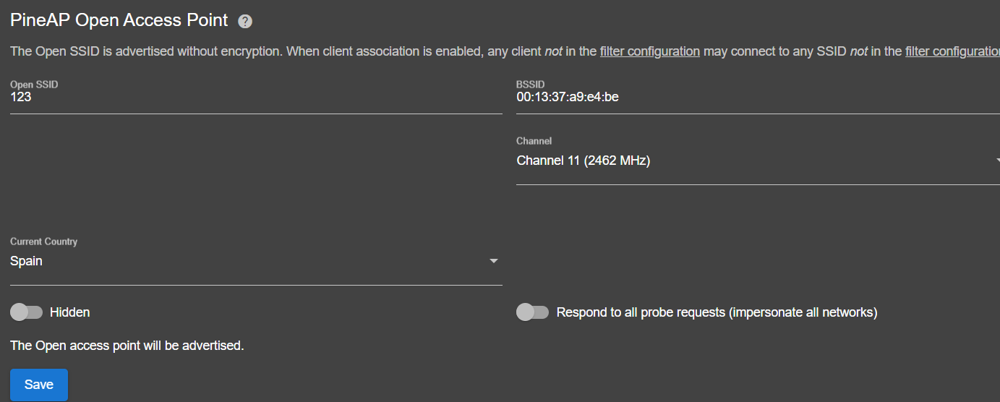
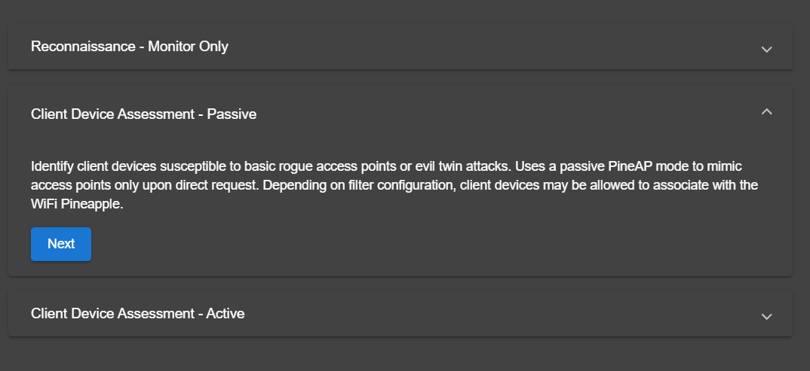
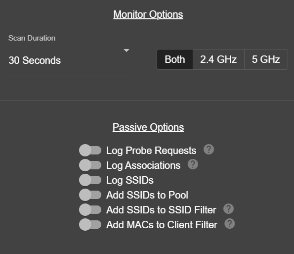
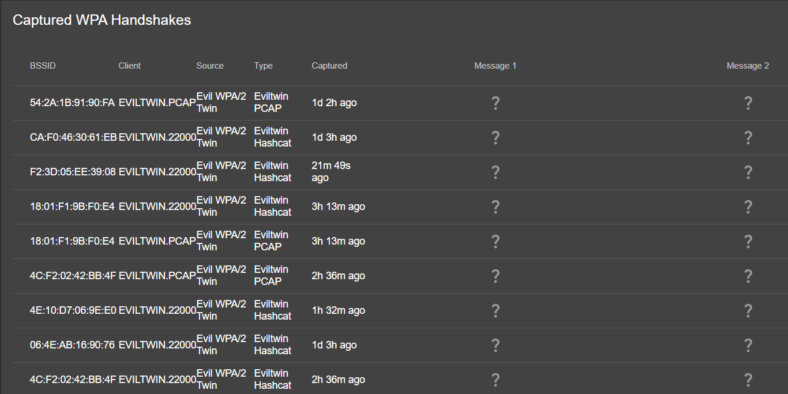
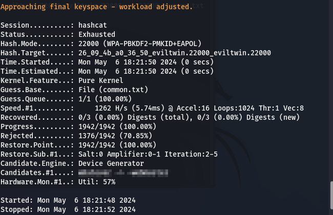
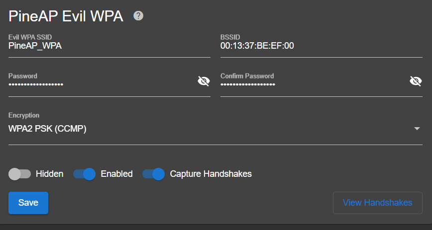
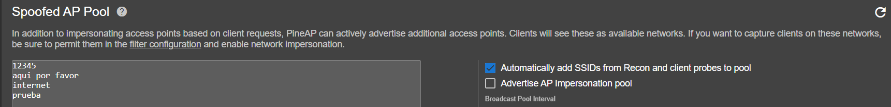
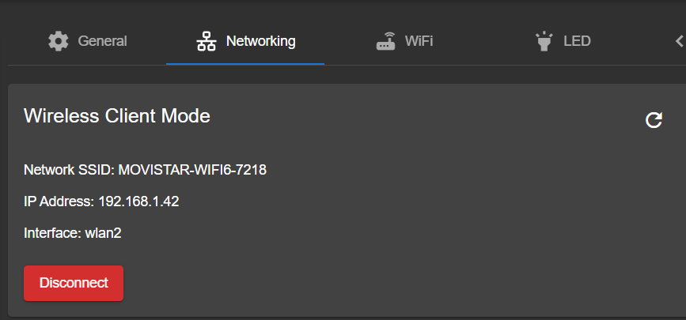
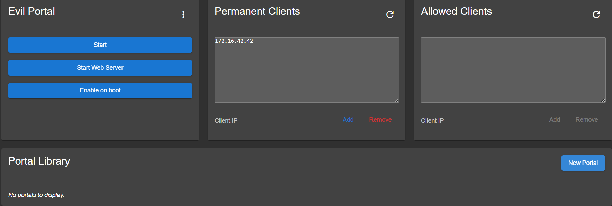
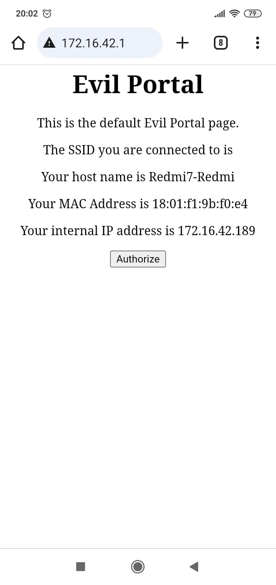

# Proyecto 9 HE

El WiFi Pineapple Mark VII es una herramienta en el ámbito del pentesting de redes inalámbricas. Se utiliza para evaluar la seguridad de redes WiFi y puede ejecutar una variedad de ataques y pruebas de penetración.

## Aplicaciones en Pentesting

- **Rogue Access Point (Punto de Acceso Falso):** Se puede configurar para crear puntos de acceso falsos que imitan a redes legítimas. Esto puede utilizarse para realizar ataques de “Man in the Middle” (MITM) o para recopilar información sobre dispositivos que se conectan a la red falsa.
- **Deauthentication (Desautenticación):** La herramienta puede enviar paquetes de desautenticación  dispositivos conectados a redes WiFi, forzándolos a desconectarse temporalmente. Esto puede ser utilizado para llevar a cabo ataques de fuerza bruta o para realizar análisis de seguridad de la red.
- **Captura de Handshakes de WPA/WPA2:** Se puede utilizar para capturar handshakes de autenticación de redes protegidas con WPA/WPA2. Estos handshakes pueden ser luego utilizados en ataques de fuerza bruta para descifrar contraseñas de red.
- **Evil Twin (Gemelo Malvado):** Con la función de Evil Twin, puede imitar un punto de acceso legítimo para engañar a los dispositivos para que se conecten a él. Esto puede ser utilizado para interceptar el tráfico de red y llevar a cabo ataques MITM.
- **DNS Spoofing (Suplantación de DNS):** La herramienta puede utilizare para realizar ataques de suplantación de DNS, redirigiendo el tráfico de red a sitios web maliciosos o falsificados.
- **Captive Portal (Portal Cautivo):** Se puede configurar un portal cautivo para interceptar y redirigir el tráfico web de los dispositivos que se conecten. Esto puede utilizarse para fines de phishing o para mostrar mensajes de advertencia a los usuarios.
- **Captura de tráfico:** El dispositivo puede utilizarse para capturar y analizar el tráfico de red inalámbrica, lo que permite identificar vulnerabilidades y patrones de comportamiento.
- **Ataques de descubrimiento de redes:** Se puede utilizarse para escanear el entorno en busca de redes WiFi disponibles, así como para obtener información sobre los dispositivos que se conectan a ellas.
- **Ataques de figerprinting de dispositivos:** Mediante el análisis del tráfico de red y la identificación de las huellas digitales de los dispositivos, se puede utilizarse para obtener información sobre los dispositivos conectados a una red inalámbrica.
- **Ataques de inyección de paquetes:** La herramienta puede utilizarse para realizar ataques de inyección de paquetes, manipulando el tráfico de red para realizar diversas acciones, como la interceptación de comunicaciones o la ejecución de ataques de denegación de servicio.
- **Análisis de seguridad de red:** Se puede utilizarse para evaluar la seguridad de una red inalámbrica mediante identificación de vulnerabilidades, la realización de pruebas de penetración y generación de informes detallados sobre los hallazgos

## Modos de Funcionamiento

- **Modo AP (Punto de Acceso):** En este modo, actuara como un punto de acceso inalámbrico normal. Los dispositivos pueden conectarse a él como lo harían con cualquier otro punto de acceso WiFi.
- **Modo Cliente:** En este modo, se conecta a una red inalámbrica existente como lo haría un dispositivo cliente.
- **Modo Repeater (Repetidor):** Puede configurarse para actuar como un repetidor inalámbrico, extendiendo el alcance de una red WiFi existente.
- **Modo Bridged (Puente):** En este modo, actuará como un puente entre una red cableada y una red inalámbrica. Esto permite que los dispositivos conectados a la red cableada accedan a la red inalámbrica, y viceversa.
- **Modo Mesh (Malla):** Puede configurarse para formarte parte de una red inalámbrica de malla, en la que varios dispositivos se interconectan para crear una red autoconfigurable y resistente.
- **Modo Stealth (Sigilo):** En este modo, se oculta su presencia en la red, haciendo que sea más dificil de detectar por dispositivos y herramientas de escaneo.
- **Modo Monitor:** En este modo, escanea activamente el espectro de frecuencia WiFi para detectar redes cercanas, dispositivos y actividad.
- **Modo Captive Portal (Portal Cautivo):** En este modo, puede servir como un portal cautivo, lo que significa que los dispositivos que se conecten a él son redirigidos a una página web especifica antes de obtener acceso a Internet.
- **Modo de Descubrimiento de Redes (SSID Pool):** En este modo, cambia automáticamente entre varios SSIDs predefinidos, lo que dificulta la detección por parte de dispositivos que intentan identificar puntos de accesos falsos.
- **Modo de Análisis de Canal (Channel Analyzer):** En este modo: puede analizar los canales WiFi cercanos para identificar interferencias y seleccionar automáticamente el canal menos congestionado para su funcionamiento.
- **Modo de Monitoreo de Tráfico (Packet Capture):** Este modo permite capturar y analizar el tráfico de red inalámbrica en tiempo real. Es útil para la detección de amenazas, el análisis forense y al depuración de problemas de red.
- **Modo de Pruebas de Seguridad (Security Testing):** Este modo se configura para realizar automáticamente una serie de pruebas de seguridad predefinidas en redes WiFi cercanas, identificando posibles vulnerabilidades y puntos débiles.
 
## Vulnerabilidades que se pueden explotar

**1. Vulnerabilidades de configuración:** Las redes Wi-Fi a menudo están mal configuradas, lo que puede permitir a un atacante acceder a la red y robar información confidencial. Por ejemplo, muchas redes utilizan contraseñas débiles o predeterminadas que pueden ser fácilmente adivinadas por un atacante. Además, algunas redes pueden no utilizar ningún tipo de cifrado, lo que significa que todo el tráfico de red puede ser interceptado y leído por un atacante. El Wi-fi Pineapple Mark VII puede ser utilizado para identificar estas vulnerabilidades de configuración y explotarlas.

**2. Vulnerabilidades de protocolo:** Los protocolos de red Wi-Fi tienen varias vulnerabilidades conocidas que un atacante puede explotar. Por ejemplo, el protocolo WEP es conocido por ser inseguro y puede ser fácilmente roto por un atacante. Además, el protocolo WPA2, que es más seguro que WEP, también tiene algunas vulnerabilidades conocidas. El Wi-fi Pineapple Mark VII puede ser utilizado para explotar estas vulnerabilidades de protocolo y obtener acceso a la red.

**3. Vulnerabilidades de dispositivo:** Los dispositivos que se conectan a una red Wi-Fi pueden tener sus propias vulnerabilidades que un atacante puede explotar. Por ejemplo, un atacante puede utilizar un ataque de desautenticación para forzar a un dispositivo a desconectarse de la red. Una vez que el dispositivo ha sido desconectado, el atacante puede intentar robar su información de inicio de sesión cuando intenta volver a conectarse a la red. El Wi-fi Pineapple Mark VII puede ser utilizado para llevar a cabo este tipo de ataques.

**4. Ataques de gemelo malvado (Evil Twin):** El Wi-fi Pineapple Mark VII puede ser utilizado para crear un punto de acceso falso que imita a una red Wi-Fi legítima. Cuando un dispositivo se conecta a este punto de acceso falso, el atacante puede interceptar el tráfico de red, capturar las credenciales del usuario y lanzar ataques más sofisticados. Este tipo de ataque es especialmente efectivo en lugares públicos donde hay muchas redes Wi-Fi abiertas, como cafeterías o aeropuertos.

**5. Captura de handshakes:** El Wi-fi Pineapple Mark VII puede ser utilizado para capturar handshakes entre un dispositivo y un punto de acceso. Estos handshakes contienen información que puede ser utilizada para romper la contraseña de la red Wi-Fi. Una vez que el atacante ha capturado un handshake, puede utilizar una herramienta de cracking de contraseñas para intentar romper la contraseña.

**6. Ataques de portal cautivo:** Un portal cautivo es una página web que se muestra a los usuarios antes de que puedan acceder a la red Wi-Fi. Los atacantes pueden utilizar el Wi-fi Pineapple Mark VII para crear un portal cautivo falso que imita al portal cautivo legítimo. Cuando un usuario intenta conectarse a la red Wi-Fi, se le muestra el portal cautivo falso y se le pide que introduzca sus credenciales. El atacante puede entonces capturar estas credenciales y utilizarlas para acceder a la red.

## Pruebas de Concepto

- **Rogue access point:**

Para establecer un Rogue Access Point, basta con acceder la interfaz web del dispositivo, ir a PineAp Suite, y seleccionar la opción de Open AP. Allí, se podrá configurar el punto de acceso de manera que puedan conectarse otros usuarios directamente al dispositivo.

- **Captura de handshakes de WPA/WPA2:**

Para poder llegar a hacer la captura de handshakes, se debe realizar un escaneo para poder descubrirlos. Para ello, se realiza una Campaña (Campaign), para establecer una serie de escaneos automáticos. 

Existen tres tipos de escaneos, uno de reconocimiento, uno pasivo y otro activo. El modo de reconocimiento hace que solo revise la actividad del dispositivo cliente y su punto de acceso, mientras que en el modo pasivo procede a verificar que dispositivos pueden ser vulnerables a ataques de Evil Twin o Rogue Access Point attacks de manera pasiva, sólo cuando piden una solicitud directa. El modo activo procede a hacer un SSID pool con todos los puntos de acceso escaneados, imitándolos para ejecutar las pruebas.

Aqui podemos ver los tipos de opciones que podemos escoger para nuestro escaneo, junto con el tiempo que durará el escaneo. Después, se establecerán los filtros de Cliente y SSID, para determinar cuales pueden ser escaneados y cuales evitan el escaneo en primer lugar, y finalmente se podrá establecer que la campaña esté activa y la frecuencia en la que se ejecute. Una vez ejecutada la campaña, se registrarán los handshakes en el proceso. Finalmente, podremos ver los handshakes recogidos en el apartado de Recon -> Handshakes

Acto seguido, podemos descargar el handshake y hacerle el comando hashcat, para obtener tanto el punto de acceso, como la contraseña del dicho punto de acceso.

- **Evil Twin:**

Para establecer un Evil Twin, basta con acceder la interfaz web del dispositivo, ir a PineAp Suite, y seleccionar la opción de Evil WPA. Allí, se puede establecer el nombre, SSID, contraseña y el modo de encriptación que va a ejecutar el Evil Twin, además de poder capturar handshakes que ocurran dentro del Evil Twin.

- **Ataque de descubrimiento de redes e impersonar**

Para poder hacer el ataque de descubrimiento e impersonación, es una mezcla de lo explicado anteriormente en la captura de Handshakes de WPA/WPA2. Primero, se dirige a PineAp Suite, y se selecciona Impersonation. Allí, se marca la opción de Automatically add SSIDs from Recon and client probes to pool. Eso hará que cuando se ejecute la campaña programada anteriormente, pasará a recopilar todos los SSID para poder ejecutar la impersonación, pudiendo empezar a hacerlo a través de Advertise Impersonation pool. 

- **Modo Cliente**

El Pineapple Wifi no tiene por su cuenta internet, por lo que es necesario otorgárselo. Una de las maneras es el Modo Cliente, que se procede a hacer mediante la conexión directa a una red inalámbrica existente, que se puede realizar yendo a Settings -> Networking. En Wireless Client Mode, se selecciona la red inalámbrica con su contraseña si la tiene, y se procede a conectar, dando pie a que se pueda realizar la conexión a internet.

- **Evil Portal**

Para poder ejecutar este ataque de portal cautivo, se debe pasar a instalar un modulo llamado Evil Portal, en Modules & Packages, y se accede dentro del módulo.

Una vez hecho, se puede proceder a crear un portal, que está categorizado entre Básico y Avanzado. En este caso, seleccionaremos el Básico, aunque el Avanzado permitiría elaborar uno bastante más elaborado. Una vez creado, activamos el Evil Portal y el portal, y conectándonos al Rogue Access Point, ponemos la dirección del router, pudiendo ver el Evil Portal.

