# Proyecto 6: Hackeando a Tux

## **Índice**

## **Resumen Ejecutivo**

Durante la auditoría de vulnerabilidades en las máquinas "MS3 Ubuntu", "Kioptrix" y "W1R3S", se identificaron diversas debilidades que abarcan múltiples niveles de riesgo y criticidad. En "MS3 Ubuntu", predominan las vulnerabilidades de información, con algunas de riesgo medio y bajo. Por otro lado, en "Kioptrix", se encontró una concentración significativa de vulnerabilidades críticas y de alto riesgo, lo que indica un nivel potencialmente alto de vulnerabilidad. Mientras tanto, en "W1R3S", la mayoría de las vulnerabilidades se clasificaron como de información, con solo unas pocas de riesgo medio y alto. 

### Alcance

Según el acuerdo realizado con la empresa “Pata de Palo Crop Boss”, nos han asignado una auditoría de caja negra, sin ninguna restricción a los siguientes equipos:

- Equipo Metasploitable3 Ubuntu
- Equipo Kioptrix
- Equipo W1r3s

### **Índices de gravedad de los hallazgos**

Los resultados presentados en las tablas son el producto de análisis de vulnerabilidades realizados en los objetivos dados por la empresa. Estos análisis han revelado una diversidad de vulnerabilidades que abarcan diferentes niveles de riesgo y criticidad.

| Riesgo | MS3 Ubuntu | Kioptrix | W1r3s |
| --- | --- | --- | --- |
| Crítico | 1 | 23 | 0 |
| Alto | 2 | 43 | 1 |
| Medio | 9 | 67 | 1 |
| Bajo | 3 | 14 | 0 |
| Información | 74 | 63 | 36 |

### Factores de riesgos

Los factores de riesgo de CVSS, aplicados a los hallazgos de vulnerabilidades nos ofrecen una visión detallada de la criticidad de cada vulnerabilidad, desde aquellas con impacto limitado hasta aquellas con consecuencias devastadoras. 

| Nivel de Criticidad | Puntuaciones | Descripción de la Criticidad |
| --- | --- | --- |
| Bajo | 0.0 - 3.9 | Vulnerabilidades con impacto limitado o que requieren condiciones poco probables para ser explotadas. |
| Medio | 4.0 - 6.9 | Vulnerabilidades con un impacto moderado que pueden ser explotadas bajo ciertas condiciones. |
| Alto | 7.0 - 8.9 | Vulnerabilidades con un impacto significativo y que pueden ser fácilmente explotadas. |
| Crítico | 9.0 - 10.0 | Vulnerabilidades con un impacto devastador y que pueden ser explotadas de manera trivial o sin requerir autenticación. |

# Resultados técnicos

## Máquina Kioptrix

### SMB Signing not Required

| Descripción: | En el SMB no está puesta la opción de requerir signing, haciendo que cualquier atacante malicioso pueda realizar man in the middle para obtener información del sistema, incluyendo usuarios. |
| --- | --- |
| CVSS v3.0 | 5.9 |
| CVE/CWE | https://nvd.nist.gov/vuln/detail/CVE-2016-2115 |
| Riesgos: | Medio |
| Impacto: | Pueden hacer ataques de Man in the middle para poder acceder a información privilegiada. |
| Sistemas | Kioptrix |
| Remediación: | Obligar el signing en los equipos. |
| Referencias: | https://nvd.nist.gov/vuln/detail/CVE-2016-2115, https://www.tenable.com/cve/CVE-2016-2115 |
| Prueba de Concepto | 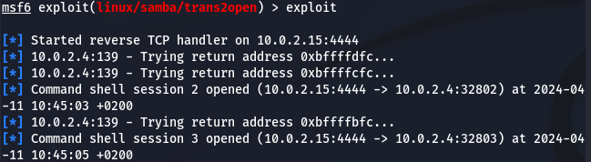 .png) |

### SSL Buffer Overflow

| Descripción: | El código de dbm y shm cache de sesión antes de la versión 2.8.7-1.3.23, y Apache-SSL 1.3.22+1.46, no inicializa correctamente la memoria usando la función i2d_SSL_SESSION, que permite al atacante malicioso usar el overflow del buffer para ejecutar código arbitrario mediante un certificado largo que está firmado por un CA (Autoridad Certificada), que produce una sesión. |
| --- | --- |
| CVSS v3.0 | CVSS v2.0: 7.5 |
| CVE/CWE | https://cve.mitre.org/cgi-bin/cvename.cgi?name=CVE-2002-0082%2C |
| Riesgos: | Medio |
| Impacto: | Insertar código arbitrario dentro del Apache para obtener todos los datos de dentro. |
| Sistemas | Kioptrix |
| Remediación: | Actualizar a la versión más actual. |
| Referencias: | https://nvd.nist.gov/vuln/detail/CVE-2002-0082 |
| Prueba de Concepto |  |

---

# Máquina Metasploitable3 Ubuntu

## Ejecución de código remoto en el modulo de Drupal

| Descripción: | La versión de Drupal que se está ejecutando en el servidor web remoto se ve afectada por una vulnerabilidad de ejecución de código remoto en el módulo Coder, específicamente en el archivo coder_upgrade.run.php, debido a una validación incorrecta de la entrada proporcionada por el usuario a la función unserialize().  |
| --- | --- |
| CVSS v3.0 | 7.1 |
| CVE/CWE | CVE-2010-2075 |
| Riesgos: | Critico |
| Impacto: | Un atacante remoto no autenticado puede explotar esto, mediante una solicitud especialmente diseñada, para ejecutar código PHP arbitrario. |
| Sistemas | Metaesploitable3 Ubuntu |
| Remediación: | Actualiza el módulo Coder a la versión 7.x-1.3 / 7.x-2.6 o posterior. |
| Referencias: | “Information regarding vulnerability” https://www.cvedetails.com/cve/CVE-2010-2075/ |
| Prueba de Concepto |  |

## Robo de credenciales SQLi

| Descripción: | El archivo encontrado cuando nos conectamos al Drupal a través de un navegador web: payroll_app.php, es vulnerable a inyección de código SQL |
| --- | --- |
| CVSS v3.0 | 9.8 |
| CVE/CWE | https://cwe.mitre.org/data/definitions/89.html |
| Riesgo: | Critico |
| Impacto: | Esto puede ser utilizado por los atacantes para hacerse con la información de la base de datos, como usuarios y contraseñas. |
| Sistemas | Metaesploitable3 Ubuntu |
| Remediación: | Mejorar la configuración de SQL, validando y filtrando la entrada de la petición y denegando el uso de caracteres especiales. |
| Referencias: | https://packetstormsecurity.com/files/166580/Payroll-Management-System-1.0-SQL-Injection.html |
| Prueba de Concepto |    |

## **UnrealIRCd Backdoor Detection**

| Descripción: | The remote IRC server is a version of UnrealIRCd with a backdoor that allows an attacker to execute arbitrary code on the affected host. |
| --- | --- |
| CVSS v3.0 | 7.5 |
| CVE/CWE | https://www.incibe.es/incibe-cert/alerta-temprana/vulnerabilidades/cve-2010-2075 |
| Riesgos: | Alto |
| Impacto: | Puede ejecutar comando arbitrarios dentro del equipo |
| Sistemas | Metaesploitable3 Ubuntu |
| Remediación: | Re-descargarel software, verificar el MD5/SHA1 publicados y re-instalarlo |
| Referencias: | https://www.incibe.es/incibe-cert/alerta-temprana/vulnerabilidades/cve-2010-2075 |
| Prueba de Concepto |  |

## Apache Continuum **- Arbitrary Command Execution**

| Descripción: | La aplicación Apache Continuum que se ejecuta en el sistema tiene una vulnerabilidad de ejecución remota de código. |
| --- | --- |
| CVSS v2.0 | 9.3 |
| CVE/CWE | https://nvd.nist.gov/vuln/detail/CVE-2013-2251 |
| Riesgos: | Crítico |
| Impacto: | Un atacante puede hacer una inyección remota de código y ganar acceso al sistema. |
| Sistemas | Metaesploitable3 Ubuntu |
| Remediación: | Actualizar la versión de Apache |
| Referencias: | https://nvd.nist.gov/vuln/detail/CVE-2013-2251 |
| Prueba de Concepto | 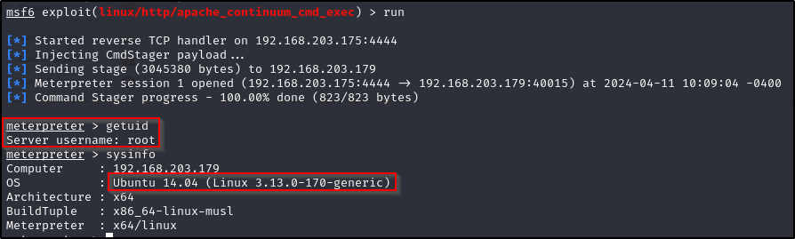 |

## ProFTPD Exploit

| Descripción: | El host remoto usa ProFTPD, un servidor FTP gratuito para Unix y Linux, versión anterior a 1.3.0a, vulnerable a manipulación de cadenas, desbordamiento de búfer en mod_tls y desbordamiento de búfer off-by-two, que podrían permitir a un atacante estrellar el servicio o ejecutar código arbitrario, dependiendo de los privilegios de la aplicación. |
| --- | --- |
| CVSS v2.0 | 10 |
| CVE/CWE | https://www.tenable.com/cve/CVE-2006-5815, https://www.tenable.com/cve/CVE-2006-6170, https://www.tenable.com/cve/CVE-2006-6171 |
| Riesgos: | Crítico |
| Impacto: | Un atacante puede ejecutar codigo arbitrario para ganar privilegios y afectar el sistema |
| Sistemas | Metaesploitable3 Ubuntu |
| Remediación: | Actualizar la version de ProFTPD a 1.3.0 o una posterior |
| Referencias: | https://www.tenable.com/cve/CVE-2006-5815, https://www.tenable.com/cve/CVE-2006-6170, https://www.tenable.com/cve/CVE-2006-6171 |
| Prueba de Concepto | 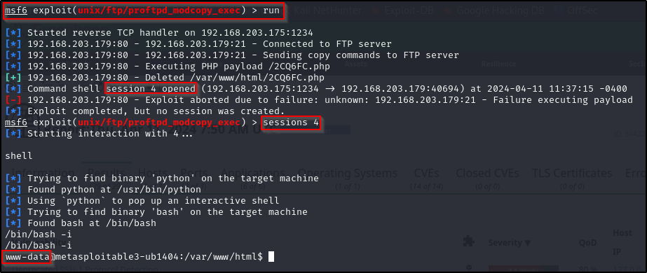 |

## Samba Enumuser

| Descripción: | Un recurso compartido NETBIOS / SMB crítico para el sistema tiene un control de acceso inadecuado |
| --- | --- |
| CVSS v3.0 | 9.8 |
| CVE/CWE | https://www.incibe.es/incibe-cert/alerta-temprana/vulnerabilidades/cve-1999-0520 |
| Riesgos: | Crítico |
| Impacto: | Un atacante puede obtener información importante del sistema |
| Sistemas | Metaesploitable3 Ubuntu |
| Remediación: | Actualizar el sistema, implementar firewalls, monitorear la red… |
| Referencias: | https://www.incibe.es/incibe-cert/alerta-temprana/vulnerabilidades/cve-1999-0520 |
| Prueba de Concepto | 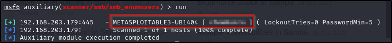 |

## SSH fuerza bruta

| Descripción: | Credenciales robadas de clientes SSH a través del programa ssh-agent, lo que permite a otros usuarios locales acceder a cuentas remotas pertenecientes al usuario ssh-agent |
| --- | --- |
| CVSS v2.0 | 7.5 |
| CVE/CWE | https://www.incibe.es/incibe-cert/alerta-temprana/vulnerabilidades/cve-1999-0013 |
| Riesgos: | Alto |
| Impacto: | Un atacante puede acceder con las otras cuentas, a información importante |
| Sistemas | Metaesploitable3 Ubuntu |
| Remediación: | Vigilar tráfico de red y limitar los usuarios que puedan entrar al SSH |
| Referencias: |  |
| Prueba de Concepto | 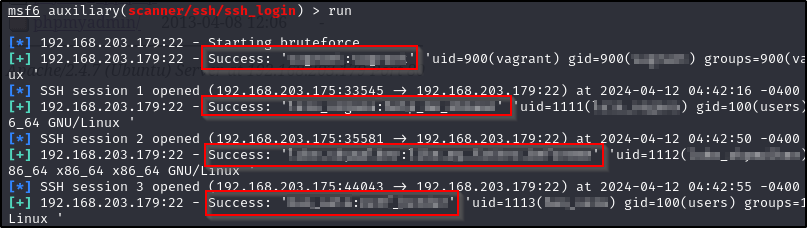 |

## Information desclosure

| Descripción: | Exposición de información confidencial no autorizado |
| --- | --- |
| CVSS v2.0 | 7.5 |
| CVE/CWE | https://cwe.mitre.org/data/definitions/200.html |
| Riesgos: | Alto |
| Impacto: | Un atacante puede acceder a información importante |
| Sistemas | Metaesploitable3 Ubuntu |
| Remediación: | Monitorear el software y aplicaciones web para que no ocurra |
| Referencias: | https://cwe.mitre.org/data/definitions/200.html |
| Prueba de Concepto | 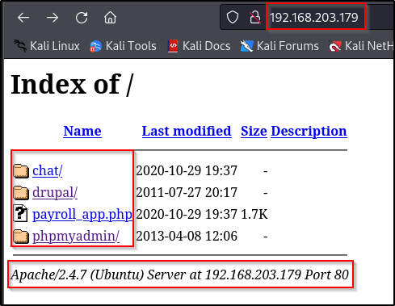 |

## Contraseñas en texto plano

| Descripción: | Almacenar contraseñas en archivos |
| --- | --- |
| CVSS v2.0 | - |
| CVE/CWE | https://cwe.mitre.org/data/definitions/256.html |
| Riesgos: | Crítico |
| Impacto: | Un atacante puede mirar los archivos y tener la contraseña para acceder a datos importantes |
| Sistemas | Metaesploitable3 Ubuntu |
| Remediación: | Cifrar las contraseñas, limitar acceso de los archivos… |
| Referencias: | https://cwe.mitre.org/data/definitions/256.html |
| Prueba de Concepto | 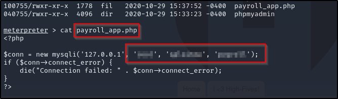 |

## Inyección puerto 3500

| Descripción: | El puerto 3500 es vulnerable a inyecciones de código SQL |
| --- | --- |
| CVSS v3.0 | 9.8 |
| CVE/CWE | https://cwe.mitre.org/data/definitions/89.html |
| Riesgos: | Crítico |
| Impacto: | Un atacante puede obtener información importante de los usuarios, el cual, le permitiría acceder al sistema |
| Sistemas | Metaesploitable3 Ubuntu |
| Remediación: | Mejorar la configuración de SQL, validando y filtrando la entrada de la petición y denegando el uso de caracteres especiales. |
| Referencias: | https://cwe.mitre.org/data/definitions/89.html |
| Prueba de Concepto | 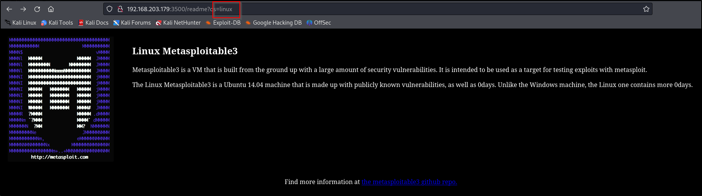 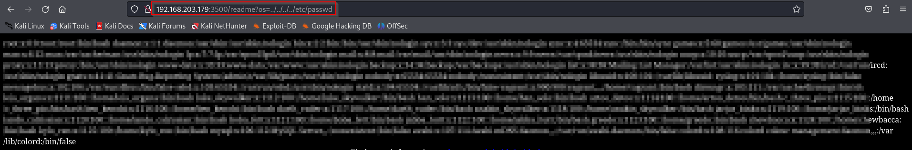|

---

## Máquina **W1R3S**

### Anonymous FTP is enabled

| Descripción: | Anonymous FTP is enabled. |
| --- | --- |
| CVSS v3.0 | 5.3 |
| CVE/CWE | https://nvd.nist.gov/vuln/detail/CVE-1999-0497 |
| Riesgos: | Medio |
| Impacto: | El atacante puede acceder a los archivos que estén disponibles y conectarse, sin necesidad de contraseña |
| Sistemas | W1R3S |
| Remediación: | Quitar el FTP anónimo si no es requerido. Revisar de vez en cuando el FTP para que no sea comprometido |
| Referencias: | https://nvd.nist.gov/vuln/detail/CVE-1999-0497 |
| Prueba de Concepto | 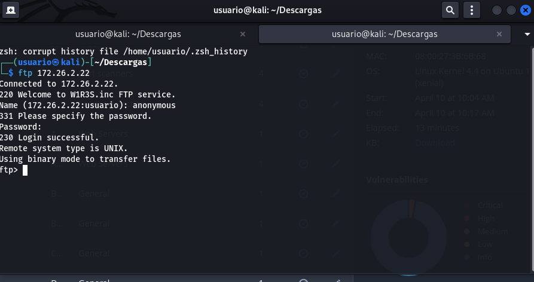  |

### Cuppa CMS Remote/Local File Inclusion Vulnerability

| Descripción: | Este host tiene instalado Cuppa CMS, el cual tiene una vulnerabilidad de inclusión de ficheros. |
| --- | --- |
| CVSS v3.0 | 7.6 |
| CVE/CWE | https://cwe.mitre.org/data/definitions/98.html |
| Riesgos: | Alto |
| Impacto: | Una explotación exitosa permitiría a los atacantes de leer e incluso, incluir ficheros arbitrarios del sistema local usando secuencias de directorios trasversales en el sistema atacado |
| Sistemas | W1R3S |
| Remediación: | Actualizar a la versión más reciente, deshabilitar las características respectivas, eliminar el programa y remplazarlo por otro… |
| Referencias: | https://cwe.mitre.org/data/definitions/98.html, https://www.securityspace.com/smysecure/catid.html?id=1.3.6.1.4.1.25623.1.0.803805 |
| Prueba de Concepto | 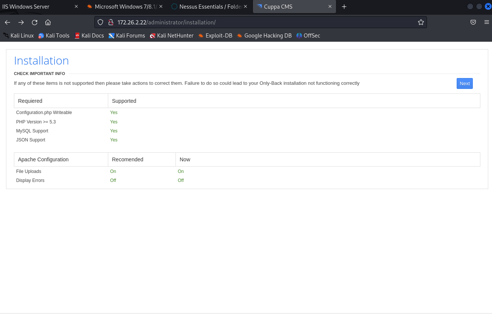 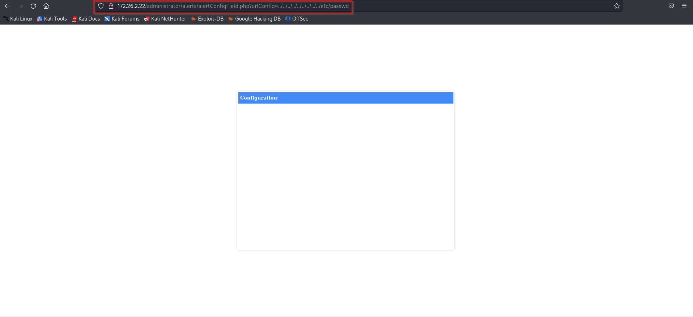 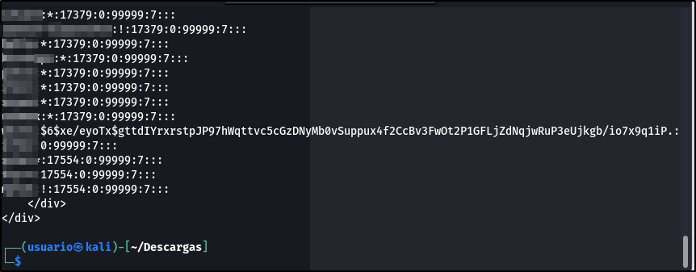 |

## Referencias Formulario de Autorización de Pentesting

- [https://www.getastra.com/blog/security-audit/penetration-testing-cost/](https://www.getastra.com/blog/security-audit/penetration-testing-cost/)
- [https://fad.es/wp-content/uploads/2019/05/Ibermática_Pen_testing-FAD.pdf](https://fad.es/wp-content/uploads/2019/05/Iberm%C3%A1tica_Pen_testing-FAD.pdf)
- Apuntes de clase
- [Perplexity](https://www.perplexity.ai/)
