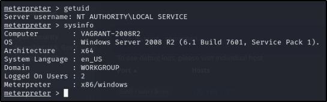

|Descripción:|
La aplicación ManageEngine Desktop Central funcionando en el host remoto es versión 8, o la versión 9 antes de la estructura 91100, por lo que es afectado por múltiples vulnerabilidades de código remoto:

- Un fallo existe en el script statusUpdate debido a un fallo de sanitizar apropiadamente el input de los usuarios en el parámetro ‘fileName’. Un atacante remoto sin autenticar puede explotar esto, mediante una petición creada para subir un archivo PHP que tiene múltiples extensiones de archivo y, mediante la manipulación del parámetro ‘applicationName’, hacen una petición directa al archivo subido, resultando en la ejecución de código arbitrario con privilegios NT-AUTHORITY/SYSTEM. (CVE-2015-8201)

-Un fallo no especificado existe en varios servlets que permiten a un atacante remoto no autenticado ejecutar código arbitrariamente. No existen más detalles.
|
| - | :- |
|CVSS v3.0|6\.0|
|CVE/CWE|[CVE-2015-8201](https://nvd.nist.gov/vuln/detail/CVE-2015-82001)|
|Riesgos:|Críticos|
|Impacto:|El atacante puede entrar a la maquina y a partir, de ahí, conseguir información y permisos necesarios|
|Sistemas|192\.168.106.144|
|Remediación:|Actualizar ManageEngine Desktop Central versión 9 build 91100 o posterior.|
|Referencias:|[CVE-2015-8201](https://nvd.nist.gov/vuln/detail/CVE-2015-82001)|
|Prueba de Concepto| 
  
 

|

