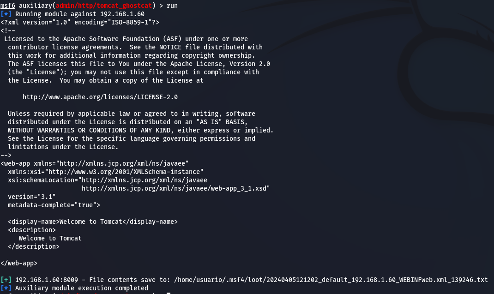
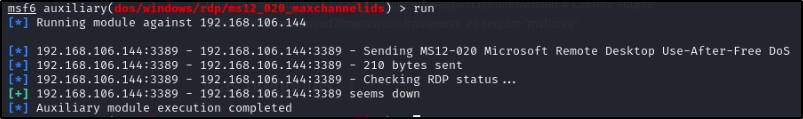

# Análisis de Vulnerabilidades
## Máquina Windows Server 2008
### ManageEngine Desktop Central 8 / 9 < Build 91100 Multiple RCE
#### (SUBIDA SIN RESTRICCIONES DE FICHEROS DE TIPOS PELIGROSOS)

|Descripción:|
La aplicación ManageEngine Desktop Central funcionando en el host remoto es versión 8, o la versión 9 antes de la estructura 91100, por lo que es afectado por múltiples vulnerabilidades de código remoto:

- Un fallo existe en el script statusUpdate debido a un fallo de sanitizar apropiadamente el input de los usuarios en el parámetro ‘fileName’. Un atacante remoto sin autenticar puede explotar esto, mediante una petición creada para subir un archivo PHP que tiene múltiples extensiones de archivo y, mediante la manipulación del parámetro ‘applicationName’, hacen una petición directa al archivo subido, resultando en la ejecución de código arbitrario con privilegios NT-AUTHORITY/SYSTEM. (CVE-2015-8201)

-Un fallo no especificado existe en varios servlets que permiten a un atacante remoto no autenticado ejecutar código arbitrariamente. No existen más detalles.
|
| - | :- |
|CVSS v3.0|6\.0|
|CVE/CWE|[CVE-2015-8201](https://nvd.nist.gov/vuln/detail/CVE-2015-8201)|
|Riesgos:|Críticos|
|Impacto:|El atacante puede entrar a la maquina y a partir, de ahí, conseguir información y permisos necesarios|
|Sistemas|192\.168.106.144|
|Remediación:|Actualizar ManageEngine Desktop Central versión 9 build 91100 o posterior.|
|Referencias:|[CVE-2015-8201](https://nvd.nist.gov/vuln/detail/CVE-2015-8201)|
|Prueba de Concepto| 
  
 

|

### MySQL Default Account Credentials
#### (Acceso a la base de datos con credenciales por defecto)

|Descripción:|El componente MySQL en Plixer Scrutinizer v9.0.1.19899 y versiones anteriores tiene una contraseña predeterminada de admin para las cuentas, lo que permite a atacantes remotos ejecutar comandos SQL arbitrarios a través de una sesión TCP.|
| - | :- |
|CVSS v3.0|9\.8|
|CVE/CWE|[CVE-2012-3951](https://cve.mitre.org/cgi-bin/cvename.cgi?name=CVE-2012-3951)|
|Riesgos:|Críticos|
|Impacto:|Un atacante remoto puede acceder y modificar la BD.|
|Sistemas|192\.168.106.144|
|Remediación:|Eliminar/cambiar las contraseñas de las cuentas afectadas.|
|Referencias:|[CVE-2012-3951](https://cve.mitre.org/cgi-bin/cvename.cgi?name=CVE-2012-3951),[ NVD](https://nvd.nist.gov/vuln/detail/CVE-2012-3951)|
|Prueba de Concepto|

|

### Apache Tomcat AJP Connector Request Injection (Ghostcat)

|Descripción:|Una vulnerabilidad de lectura/inclusión de archivo ha sido encontrada en el conector AJP. Un atacante remoto no autenticado puede explotar esta vulnerabilidad para leer archivos de aplicaciones web de un servidor vulnerable. En instancias donde el servidor vulnerable permite subidas de archivos, un atacante podría subir códigos de JavaServer Pages (JPS) maliciosos conteniendo una variedad de tipos de archivos y ganar ejecución de códigos remotos (RCE).|
| - | :- |
|CVSS v3.0|9\.8|
|CVE/CWE|[CVE-2020-1938](https://cve.mitre.org/cgi-bin/cvename.cgi?name=CVE-2020-1938),[ CVE-2020-1745](https://cve.mitre.org/cgi-bin/cvename.cgi?name=CVE-2020-1745)|
|Riesgos:|Críticos|
|Impacto:|El atacante puede leer documentos que hay dentro del servidor|
|Sistemas|192\.168.106.144|
|Remediación:|
Actualizar la configuración AJP para requerir autorización y/o actualizar el servidor Tomcat a 7.0.100, 8.5.5.51, 9.0.31

o superior
|
|Referencias:|[CVE-2020-1938](https://cve.mitre.org/cgi-bin/cvename.cgi?name=CVE-2020-1938),[ CVE-2020-1745](https://cve.mitre.org/cgi-bin/cvename.cgi?name=CVE-2020-1745)|
|Prueba de Concepto|

|

### MS11-030: Vulnerability in DNS Resolution Could Allow Remote Code Execution

|Descripción:|
Hay un fallo en la forma en el que el cliente DNS de el Windows instalado procesa las consultas de Resolución de Nombre Multicast de Enlace Local (LLMNR) puede ser explotada para ejecutar código arbitario en el contexto de la cuenta Network Service.

Es importante tener en cuenta que Windows XP y 2003 no admiten LLMNR y la explotación existosa en esas plataformas requiere acceso local y la capacidad de ejecutar una aplicación especial. Sin embargo, en Windows Vista 2008, 7 y 2008 R2, el porblema puede ser explotado de forma remota.
|
| - | :- |
|CVSS v3.0|8\.3|
|CVE/CWE|[CVE-2011-0657](https://cve.mitre.org/cgi-bin/cvename.cgi?name=CVE-2011-0657)|
|Riesgos:|Críticos|
|Impacto:|Un atacante puede provocar el agotamiento de la pila o potencialmente causar la corrupción de la memoria de la pila y producir ejecución de código.|
|Sistemas|192\.168.106.144|
|Remediación:|Microsoft ha lanzado un conjunto de parches para Windows XP, 2003, Vista, 2008, 7 y 2008 R2.|
|Referencias:|[CVE-2011-0657](https://cve.mitre.org/cgi-bin/cvename.cgi?name=CVE-2011-0657)|
|Prueba de Concepto|

|

### MS17-010: Security Update for Microsoft Windows SMB Server (4013389) (ETERNALBLUE) (ETERNALCHAMPION) (ETERNALROMANCE) (ETERNALSYNERGY) (WannaCry) (EternalRocks) (Petya) (uncredentialed check)

|Descripción:|
El host remoto de Windows se ve afectado por las siguientes vulnerabilidades:

- Existen múltiples vulnerabilidades de ejecución remota de código en Microsoft Server Message Block 1.0 (SMBv1) debido al manejo incorrecto de ciertas solicitudes. Un atacante remoto no autenticado puede aprovechar estas vulnerabilidades, a través de un paquete especialmente diseñado, para ejecutar código arbitrario. (CVE-2017-0143, CVE-2017-0144, CVE-2017-0145, CVE-2017-0146, CVE-2017-0148)

- Existe una vulnerabilidad de divulgación de información en Microsoft Server Message Block 1.0 (SMBv1) debido al manejo incorrecto de ciertas solicitudes. Un atacante remoto no autenticado puede explotar esto, a través de un paquete especialmente diseñado, para divulgar información sensible. (CVE-2017-0147)

- ETERNALBLUE, ETERNALCHAMPION, ETERNALROMANCE y ETERNALSYNERGY son cuatro de múltiples vulnerabilidades y exploits del Grupo Equation divulgados el 14/04/2017 por un grupo conocido como los Shadow Brokers. WannaCry / WannaCrypt es un programa de ransomware que utiliza el exploit ETERNALBLUE, y EternalRocks es un gusano que utiliza siete vulnerabilidades del Grupo Equation. Petya es un programa de ransomware que primero utiliza CVE-2017-0199, una vulnerabilidad en Microsoft Office, y luego se propaga a través de ETERNALBLUE.
|
| - | :- |
|CVSS v3.0|8\.1|
|CVE/CWE|[CVE-2017-0143](https://cve.mitre.org/cgi-bin/cvename.cgi?name=CVE-2017-0143),[ CVE-2017-0144](https://cve.mitre.org/cgi-bin/cvename.cgi?name=CVE-2017-0144), [CVE-2017-0145](https://cve.mitre.org/cgi-bin/cvename.cgi?name=CVE-2017-0145),[ CVE-2017-0146](https://cve.mitre.org/cgi-bin/cvename.cgi?name=CVE-2017-0146),[CVE-2017-0147](https://cve.mitre.org/cgi-bin/cvename.cgi?name=CVE-2017-0147),[ CVE-2017-0148](https://cve.mitre.org/cgi-bin/cvename.cgi?name=CVE-2017-0148)|
|Riesgos:|Alto|
|Impacto:|Permite a atacantes remotos ejecutar código arbitrario a través de paquetes manipulados|
|Sistemas|192\.168.106.144|
|Remediación:|
Microsoft ha lanzado un conjunto de parches para Windows Vista, 2008, 7, 2008 R2, 2012, 8.1, RT 8.1, 2012 R2, 10 y 2016. Microsoft también ha lanzado parches de emergencia para sistemas operativos Windows que ya no cuentan con soporte, incluidos Windows XP, 2003 y 8.

Para sistemas operativos Windows no compatibles, como Windows XP, Microsoft recomienda que los usuarios dejen de utilizar SMBv1. SMBv1 carece de características de seguridad que se incluyeron en versiones posteriores de SMB. SMBv1 se puede desactivar siguiendo las instrucciones del proveedor proporcionadas en Microsoft KB2696547. Además, el US-CERT recomienda que los usuarios bloqueen SMB directamente bloqueando el puerto TCP 445 en todos los dispositivos de límite de red. Para SMB sobre la API NetBIOS, bloquee los puertos TCP 137/139 y los puertos UDP 137/138 en todos los dispositivos de límite de red.
|
|Referencias:|[CVE-2017-0143](https://cve.mitre.org/cgi-bin/cvename.cgi?name=CVE-2017-0143),[ CVE-2017-0144](https://cve.mitre.org/cgi-bin/cvename.cgi?name=CVE-2017-0144), [CVE-2017-0145](https://cve.mitre.org/cgi-bin/cvename.cgi?name=CVE-2017-0145),[ CVE-2017-0146](https://cve.mitre.org/cgi-bin/cvename.cgi?name=CVE-2017-0146),[CVE-2017-0147](https://cve.mitre.org/cgi-bin/cvename.cgi?name=CVE-2017-0147),[ CVE-2017-0148](https://cve.mitre.org/cgi-bin/cvename.cgi?name=CVE-2017-0148)|
|Prueba de Concepto|

|

### MS12-020: Vulnerabilities in Remote Desktop Could Allow Remote Code Execution

|Descripción:|
Existe una vulnerabilidad de código remoto arbitrario en la implementación del Protocolo de Escritorio Remoto (RDP) en el host remoto de Windows. La vulnerabilidad se debe a la forma en que RDP accede a un objeto en memoria que se ha inicializado incorrectamente o se ha eliminado.

Si se ha habilitado RDP en el sistema afectado, un atacante remoto no autenticado podría aprovechar esta vulnerabilidad para hacer que el sistema ejecute código arbitrario enviándole una secuencia de paquetes RDP especialmente diseñados.

Este complemento también comprueba una vulnerabilidad de denegación de servicio en Microsoft Terminal Server.
|
| - | :- |
|CVSS v3.0|5\.9|
|CVE/CWE|[CVE-2012-0152](http://web.nvd.nist.gov/view/vuln/detail?vulnId=CVE-2012-0152), [CVE-2012-0002](http://web.nvd.nist.gov/view/vuln/detail?vulnId=CVE-2012-0002)|
|Riesgos:|Críticos|
|Impacto:|Permite al atacante realizar un ataque de denegación de servicio, apagando el equipo.|
|Sistemas|192\.168.106.144|
|Remediación:|Microsoft ha publicado un conjunto de parches para Windows XP, 2003, Vista, 2008, 7 y 2008 R2..|
|Referencias:|[https://learn.microsoft.com/en-us/security-u](https://learn.microsoft.com/en-us/security-updates/SecurityBulletins/2012/ms12-020?redirectedfrom=MSDN)|
|Prueba de Concepto|

|

### Information Exposure 

|Descripción:|El producto expone información confidencial a un tercero que no está explícitamente autorizado a tener acceso a esa información.|
| - | :- |
|CVSS v3.0|-|
|CVE/CWE|[CWE-200](https://cwe.mitre.org/data/definitions/200.html)|
|Riesgos:|Medio|
|Impacto:|Permite al atacante conocer la ubicación del fichero con las credenciales.|
|Sistemas|192\.168.106.144|
|Remediación:|Ajustar las configuraciones para prevenir inputs de los usuarios de manera directa, evitando que pueda hacer rutas directas al servidor.|
|Referencias:|[Information Exposure](https://capec.mitre.org/data/definitions/170.html)|
|Prueba de Concepto|

|

